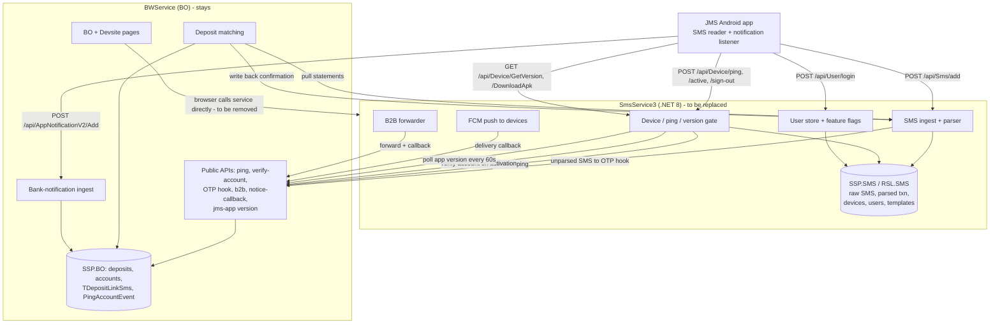

# JMS Backend Handover — 00 · Overview

**Audience**: JMS Next-Generation backend team (Go).
**Purpose**: complete description of what the current SMS Service (`SmsService3`) does today, so the new JMS backend can replace it without breaking the BO (Back Office), the Devsite and the Android fleet already in the field.
**Basis**: production source code on branch `main`, not prior documentation. Where code and old docs disagree, code wins.

> Everything here describes **behaviour the Android app or the BO relies on right now**. Any deviation is a breaking change and must be agreed by both teams before release.

---

## 1. Document index

| File | Covers | Answers BE question |
|---|---|---|
| `00-overview.md` | system map, environments, ownership split, glossary | — |
| `01-sms-ingest.md` | SMS upload: filter, verify, parse, store, forward | **Q1** |
| `02-notifications.md` | (a) BO to app push via FCM, (b) app to server bank-notification ingest | **Q2** |
| `03-device-ping-sim.md` | ping, device status, version gate, SIM activation, reset | **Q3, Q4** |
| `04-auth-user-ops.md` | login, users, leader accounts, feature flags, operator features | **Q5** |
| `05-deposit-confirm.md` | SMS to deposit confirmation (money path) and the **new contract** | Q1 follow-up |
| `06-bo-api-matrix.md` | every API between BO/Devsite and the SMS Service, both directions | **Q5** |

---

## 2. The system in one paragraph

Merchants run Android phones with bank SIMs (bKash, Nagad, Rocket, Upay in Bangladesh; other wallets elsewhere). The JMS app on each phone reads incoming bank **SMS** and bank-app **notifications**, uploads them to the server, and sends a **heartbeat (ping)**. The server parses each SMS into a *statement* (amount, reference code, balance, time). The BO matches those statements against **claimed deposits** made by end users and credits the player when a statement matches. The same fleet also receives **push notifications** from the BO, performs **B2B transfers**, and (on an unreleased branch) runs an in-app **chat**.

Money depends on three things staying alive: SMS ingest, ping, and the confirm loop. Everything else is operational tooling.

---

## 3. Current architecture

**Two separate databases, no shared tables.** All raw SMS, parsed statements, devices, users and templates live only in the SMS Service database. The BO keeps only link tables (`TDepositLinkSms`, `PingAccountEvent`, `TSmsConfirmDeposit`, `JMSLeaderAccount`). Retiring the SMS Service therefore makes the new backend the **system of record** for that data.

---

## 4. Ownership after the split

| Area | Owner |
|---|---|
| SMS ingest, parsing, regex templates, raw + parsed storage | **JMS backend (new)** |
| Stored SMS-confirm records (which SMS was used for which deposit) | **JMS backend (new)** |
| Device activation, device secrets, ping, version gate, APK distribution | **JMS backend (new)** |
| App user credentials, feature flags, login | **JMS backend (new)** |
| Push notifications to devices (FCM), B2B forwarding, chat | **JMS backend (new)** |
| Creating login users from the Devsite; creating leader-balance users | **BO / Devsite (kept)**, calling the new backend's admin API |
| Deposit to statement **matching** and crediting the player | **BO (kept)** — see `05-deposit-confirm.md` |
| Merchant / account / deposit / wallet data | **BO (kept)** |
| Bank-notification ingest (`AppNotificationV2`) | **BO (kept for now)** — see `02-notifications.md` §3 |

---

## 5. Environments

Two independent production deployments exist. They share code and nothing else.

| | Internal | Reseller (RSL) |
|---|---|---|
| SMS Service DB | `SSP.SMS` | `RSL.SMS` |
| BO host used by the service | `app.cashier-shelt77.asia` | `rspay-mc.com` (+ `bo2.smartsinterchain.top`) |
| IT site host | `it.smart-ftsolutions.com` | `it.smartsinterchain.top` |
| BO to service shared secrets | separate values, same scheme | separate values |
| Telegram alert groups | separate | separate |
| App version / APK source | `app.cashier-shelt77.asia` | **currently the same internal host** |
| S3 prefix for APK | `ssp` | **currently the same** |

> App version and APK distribution are currently a **single point shared by both environments**. The new backend must make this per-environment.

A third system code (`SP`) exists in the user model with different default feature flags, but has no separate SMS Service deployment.

---

## 6. Glossary

| Term | Meaning |
|---|---|
| **Master merchant code** | Top-level tenant, e.g. `CPS_G3`. Field name varies across APIs: `MasterMerchantCode`, sometimes `MerchantId` (as a string), sometimes `MerchantCode`. |
| **System code** | `INTERNAL` (1), `RESELLER` (2), `SP` (3). Note: in the SMS ingest payload the field named `MerchantCode` carries the **system code**, not a merchant. |
| **Device** | One Android phone plus one SIM. Keyed by `(PhoneNumber, DeviceId)`. |
| **Device secret** (`AppendString`) | Per-device shared secret issued at activation, used to sign uploads. |
| **Statement / transaction** | A parsed SMS: amount, ref code, balance, transfer time. Table `TSmsTransactionV2`. |
| **Ref code** (`TransactionCode`) | Bank transaction id (TrxID / TxnId) used to match a deposit. |
| **Claimed deposit** | A deposit the end user has claimed and which is waiting for confirmation. |
| **Leader** | View-only user tied to a balance pool: no SMS collection, heartbeat only. |
| **UIVersion** | 1 = legacy app UI, 2 = new UI. Only UIVersion 2 is subject to the minimum-version gate. |
| **Hot / cold** | Storage split: `*V2` tables are current ("hot"), non-V2 tables are frozen history ("cold"). |

---

## 7. Scale and timing to design for

| Signal | Current behaviour |
|---|---|
| Ping frequency | about one per device per minute |
| Ping batching | flush at 200 items or 45 s, whichever comes first; in-memory queue holds 5000, oldest dropped when full |
| Disconnect threshold | 10 minutes without ping counts as not connected |
| App version poll | server polls the BO every 60 s; the app reads a cached value |
| SMS ingest | one SMS per HTTP request, no batching |
| Deposit confirm loop | every 15 s (see `05-deposit-confirm.md`) |
| SMS timestamps | stored in UTC; bank time parsed out of the SMS body is **Bangladesh local (UTC+6)** and stored without conversion |

---

## 8. Release-state warning

In-app **chat** (ChatService), **JWT issuance at login**, **refresh tokens** and the internal `POST /api/fcm/send` endpoint exist in the repository on branch `feature/livechat-full-sync-260810`, which is **not merged to `main`** and therefore **not running in production**. Production login returns feature flags only, no token.

Treat chat and JWT as **planned**, not current, behaviour. They are documented in `04-auth-user-ops.md` §6 and marked as such.
