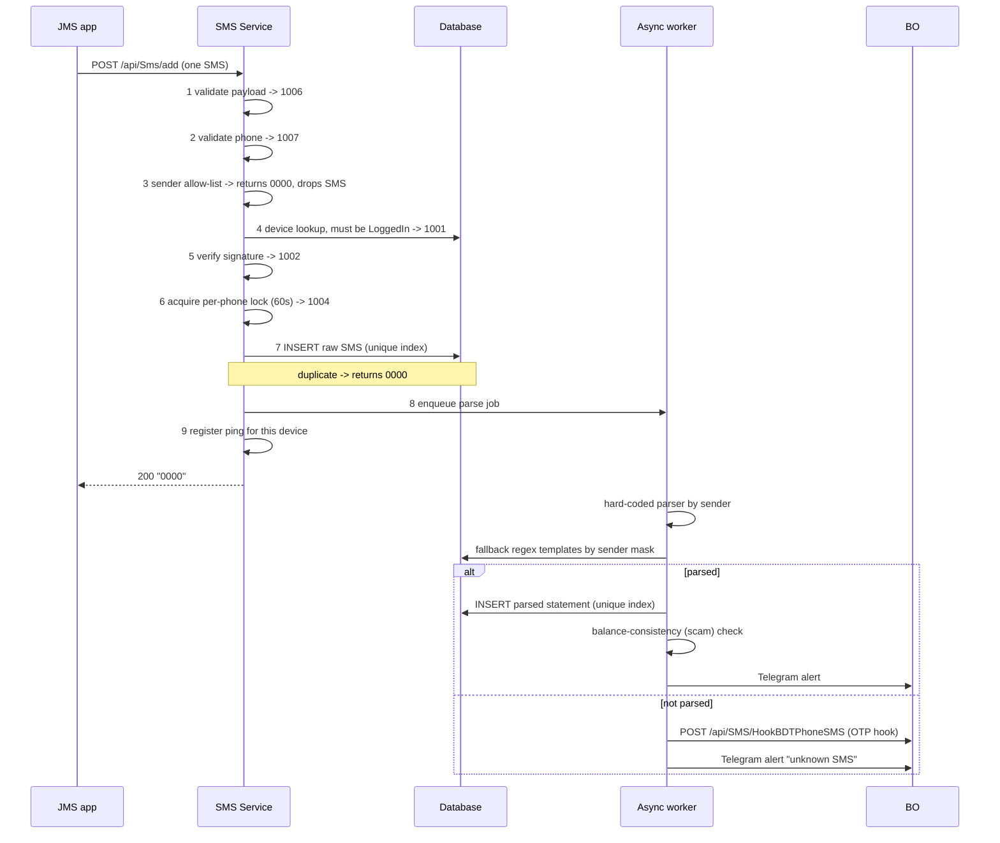

# 01 · SMS Ingest — filter, verify, parse, store, forward

> **Answers BE question 1**: "What is the business logic when an SMS is sent to the server?"

---

## 1. End-to-end flow



Key property: **the HTTP response is returned before parsing happens**. The app never learns whether its SMS produced a statement.

---

## 2. Endpoint

`POST /api/Sms/add` · `Content-Type: application/json` · one SMS per request (no batch).

### Request

| Field | Type | Required | Notes |
|---|---|---|---|
| `MerchantId` | int | yes | stored on the parsed statement |
| `MasterMerchantCode` | string | no (default `""`) | tenant code, e.g. `CPS_G3` |
| `MerchantCode` | string | yes | **holds the system code** (`INTERNAL` / `RESELLER`), not a merchant |
| `PhoneNumber` | string | yes, length 10..15 | SIM that received the SMS |
| `Content` | string | yes | raw SMS body; storage column is 1024 chars |
| `From` | string | no | sender mask, e.g. `bKash`, `NAGAD`, `16216`, `upay`, `IBBL .` |
| `Timestamp` | long | yes | **epoch milliseconds**, taken from the device clock |
| `Signature` | string | yes | see §3 |
| `DeviceId` | string | yes | device identifier |

### Response

The body is a **bare JSON string containing a code**, not an object. HTTP 200 for success, HTTP 400 for every failure.

| Code | HTTP | Meaning / when |
|---|---|---|
| `0000` | 200 | stored successfully **or** sender rejected **or** duplicate |
| `1006` | 400 | payload validation failed |
| `1007` | 400 | invalid phone number |
| `1001` | 400 | device not found, or device is not in `LoggedIn` state |
| `1002` | 400 | signature mismatch |
| `1004` | 400 | internal error, including lock timeout after 60 s |

> Note for the new backend: a rejected sender and a duplicate are both reported as success. The app therefore cannot distinguish "stored", "ignored" and "already seen". If the new backend changes this, the Android app must change with it.

---

## 3. Authentication

```
Signature = SHA256( PhoneNumber + DeviceId + DeviceSecret ) , hex, uppercase, compared case-insensitively
```

* `DeviceSecret` is the per-device value issued at activation (`03-device-ping-sim.md` §2). It is stored server-side on the device row.
* **`PhoneNumber` and `DeviceId` enter the hash exactly as they appear in the request JSON** — untrimmed and un-normalised — even though the device row is looked up by the normalised phone. See `03-device-ping-sim.md` §2.3; getting this wrong rejects the entire fleet.
* There is **no timestamp, nonce or expiry** in the signature: the same signature is valid for every request from that device for the lifetime of the activation. The only replay protection today is the database uniqueness constraint.
* There is no rate limiting on ingest. The only rate-limited endpoint in the service is the APK download.
* The signature check is compiled out in Debug builds.

Requirement for the new system: signatures must be bound to the request (body digest plus timestamp plus nonce), with a bounded acceptance window.

---

## 4. Filtering and validation, in order

1. **Payload validation** — field presence, phone length 10..15.
2. **Phone normalisation and validation** — strip `+`, then map country prefixes to a local `0` form: `880` (BD), `84` (VN), `66` (TH), `92` (PK), `95` (MM), `60` (MY) when length is at least 11..13; `977` (NP) prefix removed. Result must be 10..15 digits, digits only.
3. **Sender allow-list** — only applied when the environment flag `IS_VERIFY_SENDER` is on (it is on in both productions, off in UAT). A sender passes if it is:
   * in the hard-coded list: `16216`, `bKash`, `NAGAD`, `upay`, `8558`, `3737`, `KBZPay`, `Wave Money`, `IBBL .`, `IslamiBank`, `Islami Bank`, `IBBL`, `BRAC-BANK`; **or**
   * present in the sender-mask table (`TSmsSenderMask`, not deleted), cached for 30 seconds.

   A sender that matches neither is **dropped silently with code `0000`**.
4. **Device state** — a row must exist for `(normalised phone, DeviceId)` and its status must be `LoggedIn`.
5. **Signature** — §3.
6. **Per-phone lock** — an in-process semaphore per phone number, 60 s timeout. This does not span instances; correctness across instances relies on the unique indexes.
7. No bank-code filter at ingest. Bank code is derived after parsing.
8. **No maximum SMS age.** An SMS with a timestamp from years ago is accepted. (Relevant for the offline spooler in the new design; the accepted-age policy needs to be agreed between both teams.)
9. Length limits come from the storage layer: content 1024, sender 100, phone 20. Content longer than 1024 currently fails as an internal error (`1004`).

### Deduplication

| Layer | Key | Mechanism |
|---|---|---|
| Raw SMS | `(From, SHA256(Content), PhoneNumber, ReceivedTime)` | unique index; violation is translated to `0000` |
| Parsed statement | `(BankCode, TransactionCode, PhoneNumber, TransferredTime)` | unique index |
| Parsed statement, across hot and cold storage | same four fields, limited to the last 24 h | explicit pre-check before insert |

---

## 5. Parsing

Parsing is asynchronous, triggered by an in-process job queue.

### 5.1 Resolution order

1. Pick a hard-coded parser by substring match on the sender, evaluated in this order: `bKash` → `NAGAD` → `16216` (Rocket) → `upay`.
2. If no parser matched, or the parser returned nothing, load active regex templates for that exact sender mask from the database, ordered by `Priority` ascending, and use the first template whose regex matches.
3. If no template exists for the sender → forward to the BO OTP hook (§7) and stop.
4. If templates exist but none match → forward to the BO OTP hook and stop.
5. Otherwise build and store a statement.

### 5.2 Hard-coded parsers

Extracted fields: `Amount`, `Fee`, `Comm`, `Balance`, `TxnId`, `Customer`, `TransferredTime`.

| Bank | Cases | Date format in SMS | Amount sign rule |
|---|---|---|---|
| **bKash** | 4 | `dd/MM/yyyy HH:mm` | Case 1 (`Cash In/Out ... From:`) always positive — **known defect, see below**; Case 2 `from` positive / `to` negative; Case 3 (`You have received`) positive; Case 4 (`Send Money`) negative |
| **Nagad** | 2 | `dd/MM/yyyy HH:mm` | `Cash In Successful` and `B2B Transfer Successful` negative, otherwise positive. Case 2 accepts masked customer numbers such as `0171***8147` |
| **Rocket** | 5 | `dd-MMM-yy hh:mm:ss tt` | `Cash-In` positive / `Cash-Out` negative for the personal cases; the B2C case inverts this (`Out` positive); transfers are negative |
| **Upay** | 4 | `dd/MM/yyyy HH:mm` | `Cash-out` positive, `Send money` and `Cash-In` negative |

**Sign convention**: positive amount = money **into** the merchant wallet (customer cash-out, money received). Negative = money out (cash-in to a customer, send money, B2B transfer). Deposit confirmation only uses positive statements in practice.

> **Known defect — do not port.** In bKash Case 1 the direction is computed from the message (`Cash In` = outgoing) but is never applied to the amount, so an outgoing `Cash In` message is stored with a **positive** amount. The new implementation should apply the sign convention consistently across all cases. Keep this in mind when comparing the two parsers during the parity replay (§10): Case 1 rows are expected to differ, and the new behaviour is the correct one.

All parsers return "no result" on any exception, and currently do so **without logging**. The new implementation should log parse failures with the sender and a redacted body, because this is the main operational signal for a bank changing its SMS format.

### 5.3 Database regex templates

Table `TSmsTemplate`: `Id, BankCode, TemplateName, SenderMask, SmsContains, RegexPattern, Priority, IsActive, CreatedDate, UpdatedDate`.
Table `TSmsSenderMask`: `Id, SenderMask, TemplateId, IsDeleted` — maps an incoming sender string to its templates.

* Named capture groups recognised: `From`, `Customer`, `TxnId`, `Amount`, `Comm`, `Fee`, `Balance`, `TransferredTime`. Unknown groups are ignored.
* Matching is case-insensitive; first match by `Priority` wins.
* `SmsContains` exists in the schema but is **not used** by the matcher.
* Amount parsing tries four cultures (invariant, en-US, de-DE, fr-FR) and falls back to `0`.
* Date parsing tries 12 explicit formats and then a loose parse; on failure it yields the **minimum date value**, which is still written to storage. The new backend should reject the statement instead, because an invalid transfer time breaks both partitioning and deposit matching.
* Statements produced by templates carry **no sign information**: the amount is whatever the regex captured, always positive.

There is a test endpoint that runs a template (or the hard-coded parsers) against a sample body without storing anything; the BO parser page uses it.

---

## 6. Storage

| Table | Contents |
|---|---|
| `TSmsMessageV2` | raw SMS, current |
| `TSmsMessage` | raw SMS, frozen history |
| `TSmsTransactionV2` | parsed statements, current |
| `TSmsTransaction` | parsed statements, frozen history |

Hot/cold routing uses an id threshold plus a cutover timestamp per environment. Date-range queries are clamped to the cutover, so history before it is reachable only by reference code. **The new backend should replace this with real partitioning or a time-series layout rather than porting the split.**

### Raw SMS row

| Column | Source |
|---|---|
| `MerchantCode` | request (system code) |
| `MasterMerchantCode`, `MerchantId` | request |
| `PhoneNumber` | normalised phone |
| `From` | sender mask |
| `Content` | raw body |
| `HashContent` | `SHA256(Content)`, hex uppercase — dedup key |
| `ReceivedTime` | `Timestamp` from the device, converted to UTC |
| `CreatedTime` | server UTC at insert |

### Parsed statement row

| Column | Meaning |
|---|---|
| `BankCode` | `BKASH` / `NAGAD` / `ROCKET` / `UPAY` / template value, uppercase |
| `MerchantCode`, `MasterMerchantCode`, `MerchantId` | tenant |
| `PhoneNumber` | SIM |
| `Amount` | signed, see §5.2 |
| `RBalance` | wallet balance reported in the SMS |
| `Fee` | fee; note the separate `Comm` value parsed by some banks is **not stored** |
| `TransactionCode` | reference code, trimmed and uppercased — **the deposit matching key** |
| `Desc` | same reference code, untrimmed |
| `TransferredTime` | time parsed from the SMS body, **Bangladesh local time (UTC+6), stored as-is** |
| `CreatedTime` | server UTC |
| `EmbedData` | raw SMS body |
| `FromAccName`, `FromAccNumber` | counterparty (both set to the same value) |
| `ToAccName`, `ToAccNumber` | always empty on the SMS path |
| `MsgId`, `RequestId` | id of the raw SMS row (both) |
| `Channel` | wallet type as a string (`49` bKash, `50` Nagad, `51` Rocket, `52` Upay, `0` for template-parsed) |
| `IsValid` | currently always `true` on insert |
| `DepositId` | `0` until the BO confirms a deposit with this SMS |

### Balance-consistency ("scam") check

After insert, the service compares the new statement against the most recent valid statement for the same `(phone, bank)` inside a recent window. The window bound is computed in UTC but compared against the bank-local transfer time, so the **effective lookback is about 12 hours**, not the 6 hours the code intends. The new implementation should compare against a single time base and state the window explicitly.

```
| previousBalance + amount - currentBalance | >= 20000  ->  suspicious
```

Today the outcome of this check is **not persisted**: every statement is stored with its validity flag set to true, and a suspicious result only raises a Telegram alert to a per-tenant group. Nothing is blocked or excluded from matching, and because no row is ever marked invalid, the operator-facing "approve flagged statements" endpoint returns an empty list in practice.

**Requirement for the new backend**: keep the detection, but make the outcome a stored, explicit state (`valid` / `suspect` / `approved`), so that the operator review screen has something to act on and the BO can decide whether suspects are matchable. Confirm with operations whether the review step is still wanted before building it.

---

## 7. Outbound calls after ingest

| Target | When | Payload | Retry |
|---|---|---|---|
| BO `POST /api/SMS/HookBDTPhoneSMS` | SMS could not be parsed | `{ Phone, Messages: [{ Sender, Message, Timestamp }], Signature }` where `Signature = SHA256(Phone + BO_SMS_Secret_Key)` as hex, uppercase — a **single** SHA-256 pass, and `Timestamp` is **epoch seconds** (note: ingest uses milliseconds) | 3 attempts, 1 s apart |
| Telegram | parsed successfully | statement summary to the operations group | none |
| Telegram | balance check suspicious | alert to the tenant's group | none |
| Telegram | SMS not parsed | "unknown SMS" alert | none |
| Internal ping registration | every ingest | treated as device activity | n/a |

**There is no push of the parsed statement to the BO on the ingest path.** A code path for it exists but is disabled. Today the BO pulls (see `05-deposit-confirm.md`).

On repeated failure the outbound call throws, the exception is caught and logged, and the statement stays in the database with no retry marker and no dead-letter queue. The new backend needs a durable outbox for anything it must deliver to the BO.

---

## 8. Time handling

| Value | Basis |
|---|---|
| `Timestamp` in the request | device clock, epoch milliseconds |
| `ReceivedTime` | that timestamp converted to UTC |
| `CreatedTime` (raw and parsed) | server UTC |
| `TransferredTime` | **Bangladesh local time (UTC+6)** parsed from the SMS text, stored without conversion |
| Date-range queries over statements | the UTC bound is shifted by +6 h before comparison |
| Times returned to BO pages | shifted by +6 h for display |
| Timestamp sent to the BO OTP hook | epoch **seconds** |

The `+6` offset is hard-coded in several places rather than configured. The new backend should store an unambiguous instant plus the source timezone, and expose both.

---

## 9. Durability gaps to close in the new implementation

These are properties of the current implementation that the new system is expected to improve on, not behaviour to reproduce:

1. The parse job queue is **in-memory**. A process restart loses queued jobs: the raw SMS is stored but no statement is ever produced for it. A durable queue or an outbox table is required.
2. The per-phone lock is in-process, so it does not serialise across instances.
3. Parser failures are silent.
4. Suspicious statements are alerted but not marked in the data.
5. Ingest accepts an arbitrarily old SMS; with an offline spooler this needs an explicit policy agreed between both teams.
6. A statement whose date failed to parse is still stored with an unusable timestamp.

---

## 10. Parity testing

Recommended acceptance test before cutover: replay a fixed corpus of production SMS bodies through both the current parser and the new one and diff the resulting statements on `(BankCode, TransactionCode, Amount, RBalance, Fee, TransferredTime, sign)`.

Minimum corpus: every case listed in §5.2 (15 hard-coded cases) plus one sample per active row in `TSmsTemplate`, plus known negatives (OTP messages, marketing SMS, masked-number variants). The BO team can export this corpus from the raw SMS table.
