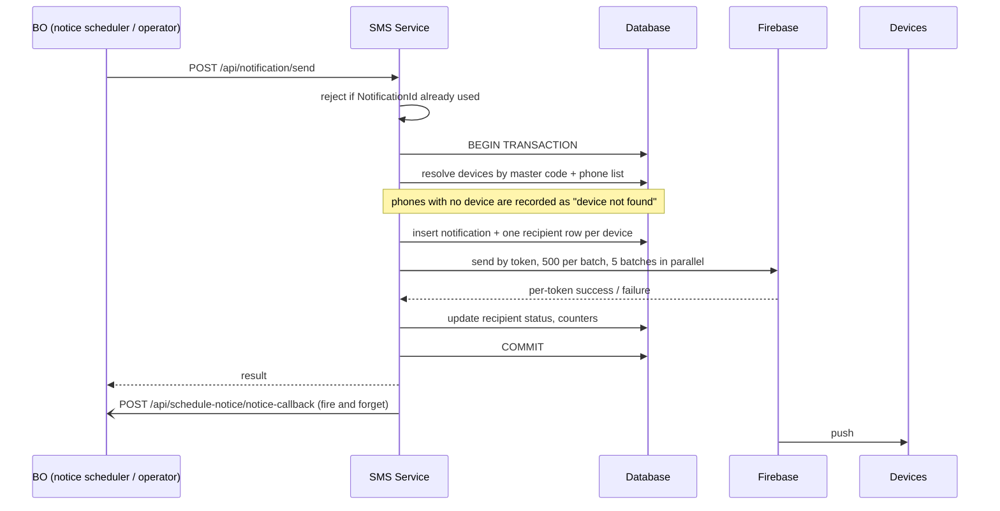
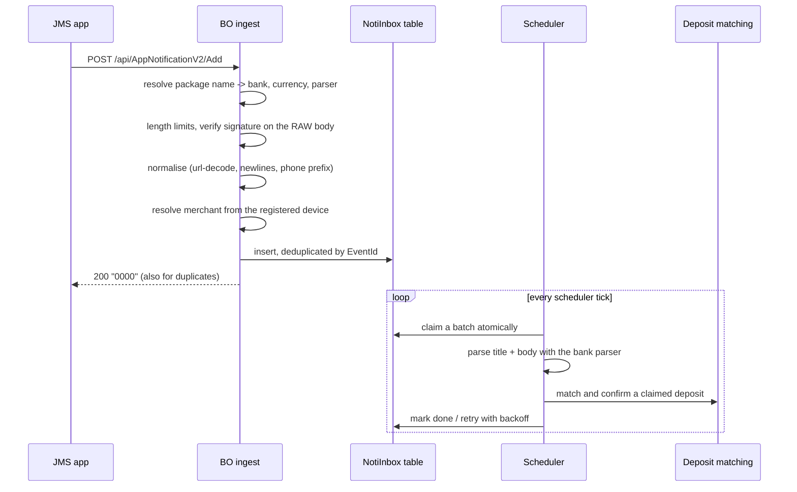

# 02 · Notifications

> **Answers BE question 2**: "Same question as SMS, for Noti."

"Noti" means two different things in this system. They share no code, no storage and no contract. Both are described here.

| | **A. Outbound push** | **B. Bank-notification ingest** |
|---|---|---|
| Direction | BO to device | device to server |
| Handled by | SMS Service (`/api/Notification/*`) | **BO directly** (`/api/AppNotificationV2/Add`) — the SMS Service is not involved |
| Purpose | operational messages to operators holding the phones | capture bank app notifications as payment evidence |
| Money path | no | **yes** — confirms deposits |

---

# A. Outbound push (BO to device, via FCM)

## A.1 Flow



## A.2 Endpoints

All under `/api/notification/`. Called by the BO server (never by the app). **None of them carries authentication today**; they are only reachable inside the internal network. The new backend must authenticate them.

| Endpoint | Purpose |
|---|---|
| `POST send` | create and deliver a notification |
| `POST edit` | change content and re-deliver |
| `POST resend` | re-deliver to recipients that failed |
| `POST get-by-id`, `POST get-by-ids` | read |
| `POST get-statistics` | counts: sent, failed, read |
| `POST get-recipients` | paged recipient list with status |

### `send` request

| Field | Type | Required | Notes |
|---|---|---|---|
| `NotificationId` | int | yes, > 0 | **id generated by the BO; acts as the idempotency key** |
| `MerchantCode` | string | yes | master merchant code |
| `PhoneNumbers` | string[] | yes, non-empty | target SIMs |
| `Title` | string | yes, max 256 | |
| `Body` | string | yes, max 2000 | |
| `ImageUrl` | string | no | |
| `Data` | object | no | passed through to the FCM data payload |

A repeated `NotificationId` is rejected as a duplicate.

## A.3 Recipient resolution and storage

* Devices are selected by **master merchant code plus the supplied phone list**, and must have both a non-empty device id and a non-empty FCM token.
* A phone with no matching device still produces a recipient row marked "device not found", so the BO can show operators which phones were unreachable.
* Storage:
  * notification: id (BO id), tenant, title/body/image/data, device count, success / failure / read counters, status (`Sent`, `Failed`, `Pending`).
  * recipient: one row per (notification, device, phone) with status (`Pending`, `Sent`, `Failed`), error message, retry count, read flag.
* `edit` soft-deletes the previous recipient set and rebuilds it.
* `resend` only picks failed recipients and **stops retrying a recipient after 10 attempts**.

## A.4 Delivery

Firebase Admin SDK, **addressed by device token, not by topic**. Tokens are batched 500 per call with up to 5 calls in flight. Tokens come from the device table and are refreshed on every ping and login.

## A.5 Callback to the BO

`POST {BO}/api/schedule-notice/notice-callback`

```
{ NotificationId, MerchantCode, Status, DisplayedStatus,
  TotalDevices, SuccessCount, FailedCount, ReadCount }
```

Sent fire-and-forget after delivery: the HTTP call retries up to **3 times, one second apart**, and is then dropped. There is **no outbox and no persistence**, so the callback is at-most-once — if all three attempts fail, the BO's notice page shows a stale status until someone re-reads the notification. The new backend should make this delivery at-least-once, durable across restarts, and idempotent on `NotificationId`.

## A.6 Internal FCM endpoint (planned, not in production)

On the unreleased chat branch there is `POST /api/fcm/send`, authenticated with a header-based internal key compared in constant time, used by the chat service to push a message to one user. It resolves a token from the device table, falling back to the leader-device table when the "phone" is actually a leader username. Title and body are truncated to 250 characters. Include this in the new backend if chat ships.

---

# B. Bank-notification ingest (device to server)

**This traffic does not go through the SMS Service — the app posts it straight to the BO.** It is documented here because the JMS app team owns both paths and because the new SMS backend should follow this design rather than the SMS one: it is the newer and more robust of the two.

Two generations run in parallel:

* **V1** (`/AppNotification/Notification`) — VND and THB banks, processed synchronously inside the request.
* **V2** (`/api/AppNotificationV2/Add`) — MYR banks, asynchronous. **Use V2 as the reference design.**

## B.1 V2 flow



## B.2 Request

| Field | Type | Required | Notes |
|---|---|---|---|
| `PhoneNumber` | string | yes | identifies the collecting device, matched against account configuration |
| `Title`, `Content` | string | yes | max 512 / 4000 |
| `PackageName` | string | effectively yes | **primary routing key** (Android package of the bank app) |
| `DeviceId` | string | yes | |
| `MasterMerchantCode` | string | conditional | trusted only when the device is not registered |
| `Timestamp` | long | no | epoch ms; replaced with "now" when missing or non-positive |
| `Type` | enum | legacy | fallback routing only when `PackageName` is empty |
| `Signature` | string | yes | see below |

### Signature

```
AppendString = MasterMerchantCode + PackageName + PhoneNumber + DeviceId + Timestamp + Title + Content
```

Concatenated with **no separator**. Verified against the device's own secret when the device has registered, otherwise against a platform-wide shared key.

Two properties worth copying:

* the signature covers the **content**, so a body cannot be altered in transit;
* it is verified on the **raw request, before normalisation** — normalising first would hash something the app never signed.

## B.3 Validation order and result codes

| Step | Failure code |
|---|---|
| body present and bindable | `1006` |
| package name resolves to a known bank | `1012` |
| title and content within length limits | `1006` |
| signature valid | `1002` |
| normalise (url-decode, escaped newlines, phone prefix) | — |
| phone present | `1007` |
| merchant resolved | `1001` |
| stored (or duplicate) | `0000` |
| storage failure | `1099` (HTTP 500, tells the app to retry) |

Response body is a bare code string, as with SMS. A correlation id and an event id are returned in response headers.

**Cross-merchant protection**: if the device is registered, the merchant is taken from the device's registration and a different `MasterMerchantCode` in the body is rejected. A device cannot post on behalf of another merchant.

## B.4 Deduplication

```
EventId = SHA256( length-prefixed: "v2", merchantCode, lowercase(packageName),
                  phone, deviceId, canonical(title), canonical(content) )
```

* every field is prefixed with its 4-byte length, so two different field splits cannot collide;
* `canonical()` = url-decode, unescape newlines, CRLF to LF, Unicode NFKC, strip zero-width characters, NBSP to space, collapse whitespace, trim;
* enforced by a unique index; a duplicate is reported as **success**, because the app must stop retrying.

## B.5 Async processing

* Rows are parked with status `Received` and drained by a scheduler.
* A batch is claimed with a single atomic statement that also re-claims rows stuck in `Processing` for more than 5 minutes.
* Processing is deliberately **sequential** (one row at a time) because it is the money path.
* Retry: exponential backoff `min(2^attempts, 300)` seconds, maximum 10 attempts; exhausted rows are kept with their last error rather than deleted.
* A configuration error (for example a bank channel that is not set up) fails fast instead of burning retries.
* Per-row outcome is stored (`ResultCode`, `Attempts`, `LastError`, `AccountId`, `TransactionId`) and shown on a BO page, including notifications that never became a transaction.

## B.6 Parsing and confirmation

* Parsers are selected by package name; each does a cheap token check before running regexes, and every regex runs under a **250 ms timeout** which is treated as "not mine" rather than an error.
* Extracted: amount, transfer time, sender account name and number, reference code.
* **Replay guard**: before confirming, the event id is checked against already-created notifications; if a transaction was already created for it, no second confirmation happens. Without this, a retry after a partial failure could credit a different deposit.
* Matching requires an **exact amount**, the deposit's account, the right channel, and a transfer time inside a configured window ending at the transfer time. If two candidate deposits match, the result is treated as **ambiguous and nothing is confirmed** — an operator resolves it. This is the correct behaviour for money and should be preserved anywhere matching happens.

## B.7 Differences from SMS, at a glance

| | SMS | Bank notification (V2) |
|---|---|---|
| Receiver | SMS Service | BO |
| Routing key | sender mask plus bank code | Android package name |
| Signature covers content | no | **yes** |
| Deduplication | content hash plus 4 columns | canonical event id |
| Processing | fire-and-forget in-memory job | durable inbox plus scheduler |
| Retry | none | backoff, 10 attempts, stuck-row recovery |
| Per-item outcome visible to operators | no | yes |
| Currencies | BDT (and other SMS wallets) | MYR on V2, VND/THB on V1 |

**Recommendation to the JMS backend team**: build SMS ingest on the V2 shape — sign the content, deduplicate on a canonical event id, park then process, expose per-item status. The BO team will ask for the same operational visibility for SMS that exists for notifications today.
