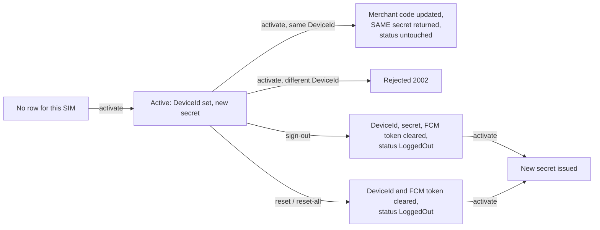

# 03 · Device, Ping, SIM Activation, App Version

> **Answers BE question 3** ("does ping do anything besides recording device status?") and **question 4** ("what must we watch out for in SIM activation?").

---

## 1. Device model

One row per **(SIM phone number, device id)** pair.

| Column | Meaning |
|---|---|
| `PhoneNumber` | SIM, normalised (see `01-sms-ingest.md` §4.2) — the business key |
| `DeviceId` | phone identifier; **empty string means signed out / reset** |
| `AppendString` | the **device secret** used to sign uploads; empty after sign-out |
| `MerchantCode` | master merchant code, uppercase |
| `Status` | `0` = LoggedOut, `1` = LoggedIn |
| `IsConnected` | set by ping, cleared by the stale sweeper (largely legacy, see §6) |
| `LastPingTime` | UTC of the last heartbeat |
| `UIVersion` | `1` or `2`, reported by the app on ping |
| `FCMToken` | push token, refreshed on ping and login, cleared on sign-out |
| `MerchantId` | always `0` today (legacy) |

Leader devices live in a separate table, see §7.

---

## 2. SIM activation

`POST /api/Device/active`

### Request

| Field | Type | Required | Notes |
|---|---|---|---|
| `PhoneNumber` | string | yes, 10..15 | SIM |
| `DeviceId` | string | yes | |
| `PublicKey` | string | yes | RSA public key, PEM or base64 SPKI |
| `MasterMerchantCode` | string | no | required in practice when account verification is enabled |
| `MerchantId` | int | no | unused |

### Response

On success: HTTP 200, body is the **device secret encrypted with the supplied public key** (RSA PKCS#1 v1.5, base64). The plaintext secret never appears on the wire.

| Code | Meaning |
|---|---|
| `1006` | payload invalid |
| `1007` | invalid phone |
| `2002` | **this SIM is already bound to a different device** |
| `2004` | the BO rejected the account (see §2.2) |
| `2003` | could not store the device |
| `2001` | encryption failed |
| `1004` | internal error |

### 2.1 State machine



Rules to preserve:

1. **One SIM is bound to one device.** Moving a SIM to a new phone requires a reset first; otherwise activation fails with `2002`.
2. **Re-activating the same device returns the existing secret** and does not change login state. The app relies on this to recover after a reinstall without losing its session.
3. Activating after a reset issues a **new** secret; the old one stops working immediately.

### 2.2 Account verification against the BO

When enabled — on in both productions and in the UAT profile, off only under the base and local profiles — the service calls the BO before creating the device:

`POST {BO}/api/account/verify-bo-account` with `{ PhoneNumber, MerchantCode }`, returning `{ IsSuccessful, Message }`. **This call is currently unsigned.** Any failure — rejection, HTTP error, malformed response, timeout — is reported to the app as `2004`, so the operator cannot tell "this SIM is not registered" from "the BO is down". The new backend should separate those two outcomes.

### 2.3 Secret generation, and one trap

The secret is `base64( SHA256( phone + "_" + deviceId + "_" + newGuid ) )`.

The secret is an **opaque** value: it embeds a fresh GUID, is never re-derived, and is only ever read back from the device row. Migrating it is a column copy, not a re-computation.

**The compatibility hazard is elsewhere, and it is the single most important detail in this document.** The string that a device signs is `PhoneNumber + DeviceId` **exactly as those two fields appear in the request JSON** — untrimmed and un-normalised — while the device row itself is located using the trimmed, normalised phone. A backend that normalises the phone before building the signed string will reject every device that reports an international-format or whitespace-padded number, and the whole fleet fails at once. Verify against real production rows before cutover.

---

## 3. Ping

`POST /api/Device/ping`

### Request

| Field | Type | Default | Notes |
|---|---|---|---|
| `DeviceId` | string | required | |
| `UIVersion` | int 0..2 | 1 | `0` means "unchanged" |
| `AppVersion` | int 0..1000 | 0 | `0` means the app did not report a version |
| `FCMToken` | string | `""` | empty means "unchanged" |
| `DeviceName` | string | `""` | accepted but **not stored** |

### Response

`200 "0000"`, or `400 "1008"` when the version gate rejects the app (§4). Ping carries **no configuration and no commands**: there is no force-logout, no force-update and no reset instruction in the ping response. The app discovers those by calling the version endpoint separately.

An unknown device id still receives `"0000"`.

### 3.1 What ping does besides updating device status

This is the direct answer to question 3. Ping has five side effects:

1. **Version gate** — rejects outdated apps with code `1008` before doing anything else (§4).
2. **Device row update** — `IsConnected`, `LastPingTime`, and conditionally `UIVersion` and `FCMToken`. This is how push notifications keep working: the token refresh rides on the heartbeat.
3. **Heartbeat forwarded to the BO** — `POST {BO}/api/account/ping` with `{ PhoneNumber, MerchantCode, LastPingTime, UIVersion }`.
   **This is the single most important side effect.** The BO uses these events to decide whether a collecting account is alive, and an account with no recent ping is **excluded from deposit routing**. A ping outage means the platform stops accepting deposits on those accounts. There was a production incident caused by exactly this. Contract, cadence and payload must not regress.
4. **Client IP capture and alerting** — the caller IP is taken from the CDN header, classified (direct / CDN / proxy-VPN), and for two specific tenants pushed to a Telegram group. Operators use this to spot devices moved outside the expected location.
5. **Leader FCM cleanup on sign-out** — signing a device out also clears leader tokens bound to the same device and notifies the BO.

### 3.2 Batching

Ping is accepted and queued, then flushed:

| Property | Value |
|---|---|
| Queue capacity | 5000, oldest dropped when full (drop count logged at flush) |
| Flush trigger | 200 queued items, or 45 seconds since the last flush |
| Deduplication inside a batch | by device id: latest ping time wins; a non-empty FCM token wins; a non-zero UI version wins |
| Database write | one round trip per flush, one update per device, written so that it does not collide with optimistic concurrency |
| Failure handling | one retry after 500 ms, then the batch is dropped and logged |
| BO forwarding | one call per device row, up to 32 concurrent, 5 s timeout, single attempt, failures swallowed |

One device id can map to several rows (a phone with several SIMs); the BO is notified once per row.

App cadence is roughly one ping per minute. The disconnect threshold used by pages and by the BO is 10 minutes.

---

## 4. App version gate and APK distribution

### 4.1 The gate

```
minimum = configured MinVersionCode (fallback 16 when config is unavailable)
if UIVersion == 2 and AppVersion != 0 and AppVersion < minimum  ->  reject ping with "1008"
```

Consequences to reproduce exactly:

* only **UIVersion 2** apps are gated; UIVersion 1 is never blocked;
* an app that reports `AppVersion = 0` is **never** blocked;
* the gate lives in the **ping path**, not in the version endpoint. A device that fails the gate simply stops being able to ping, and therefore stops collecting.

### 4.2 Where the version comes from

A background poller refreshes the configuration **every 60 seconds**. Version and APK metadata come from the BO; the minimum-version gate itself comes from whichever source the switch below selects:

`GET {BO}/api/jms-app/version?appKey=...` with header `X-JMS-Signature = SHA256(appKey + secret + "|jms-app-version")`, returning:

```
{ isSuccessful, message,
  data: { VersionCode, MinVersionCode, IsForceUpdate, IsForceLogout, ApkVersion, ApkTimestamp } }
```

* Multiple app keys are supported (one default plus named variants), each with its own configuration and its own APK folder.
* **Which source feeds the gate is a configuration switch, and in production it is not the BO.** The switch defaults to the IT site and is not overridden in either production configuration, so today the minimum version that gates the fleet is fetched from `{IT_HOST}api/Device/GetVersion` over an **unsigned** request; the signed BO call above supplies the version and APK metadata returned to the app. The poller logs a warning when the two sources disagree, and an error when the minimum version is higher than the newest published APK — that combination blocks devices that have nothing to upgrade to.
* **Requirement for the new backend**: whichever source feeds the gate must be authenticated, and the active source must be visible in monitoring. A silently mis-set gate is invisible until devices stop collecting.
* On any polling error the **last known good value is kept**; configuration is never cleared.

### 4.3 Endpoints for the app

`GET /api/Device/GetVersion?appKey=` — unauthenticated by design, because the app checks for updates before it activates.

```
{ isSuccessful, message, data: { VersionCode, ApkUrl, IsForceUpdate, MinVersionCode, IsForceLogout } }
```

Note the legacy casing: the envelope is camelCase, the payload is PascalCase. The app parses it as-is.

An unknown or malformed app key returns a validation error; a not-yet-loaded configuration returns HTTP 503.

`GET /api/Device/DownloadApk?v=&t=&appKey=` — streams the APK from object storage.

| Property | Behaviour |
|---|---|
| URL matching | the request line must match the canonical URL **byte for byte**; different parameter order or extra parameters return 404 |
| Storage key | `{envPrefix}/{folder}/app-release-v{version}-t{timestamp}.apk` |
| Missing object | 404 |
| Storage error | 502 |
| Success headers | immutable caching for one year, Android package content type |
| Error headers | no-store |
| Concurrency | limited (default 16 in flight, queue 32); over the limit returns 503 with `Retry-After: 30` |

`IsForceUpdate` and `IsForceLogout` are **not enforced by the server**; they are advisory flags the app acts on.

---

## 5. Reset, sign-out, deactivation

| Endpoint | Caller | Authentication today | Effect |
|---|---|---|---|
| `POST /api/Device/sign-out` | app | signed with the device secret | clears device id, secret and FCM token, status LoggedOut; idempotent; also clears leader tokens on the same device |
| `POST /api/Device/reset` | app | **none** (the check is disabled) | clears device id and FCM token, status LoggedOut; keeps the stored secret |
| `POST /api/Device/reset2` | BO / Devsite / operators | **none** (a signature field is accepted and ignored) | resets **every** row for that phone number |
| `POST /api/Device/reset-by-device-id?deviceId=` | operators | **none** | resets every SIM bound to that device |
| `POST /api/Device/telegram-reset-device` | Telegram bot via the BO | signed: `SHA256(phone + masterCode + secret)` | resets every device for that phone |

After a reset the app cannot sign uploads any more and must re-activate. The server never pushes a command to the device.

**Requirement**: in the new backend every reset path must be authenticated and attributed to an operator, and every reset must be recorded in an audit log with who, when and why. Operations relies on reset being available quickly, so keep the Telegram path but sign it properly.

---

## 6. Stale device sweep

A scheduled call (`POST /api/ScheduleDevice/deactive-stale-devices?limitTime=10`, every 20 minutes in the non-production schedule) clears `IsConnected` for devices whose last ping is older than the limit. It does not change login state or the device id.

Two things about this are worth knowing before reproducing it.

**The sweeper does not run in production.** Its only scheduled caller is the non-production job list, so on production the stored flag is set to true by the first ping and never cleared again.

**The value the device pages display is not the stored flag**, it is recomputed per row as:

```
displayed = (LastPingTime < now - 10 minutes  AND  storedFlag) ? false : true
```

Note what that expression does: it ignores login status entirely, and a device whose stored flag is already false is reported as **connected**. That second branch is unreachable today only because the sweeper never clears the flag in production — the two behaviours mask each other.

**Requirement for the new backend**: derive connectivity from the heartbeat alone — last ping within the threshold and the device logged in — and drop both the stored flag and the sweeper. Expose the threshold as configuration. Expect the device pages to show slightly different counts than today during dual-run; the new value is the correct one, and the difference should be reconciled rather than treated as a defect.

---

## 7. Leader devices

Leaders are view-only users attached to a balance pool. They have their own heartbeat.

`POST /api/leader-account/ping` — unauthenticated today, no version gate, no batching.

| Field | Required |
|---|---|
| `Username`, `MasterCode`, `DeviceId` | yes |
| `UIVersion`, `AppVersion`, `SystemType`, `FCMToken`, `DeviceName` | optional |

Behaviour: upsert on `(username, master code, device id)` where not deleted, updating last ping time, versions, system type, and IP/token when non-empty. Then forward to the BO, fire and forget:

`POST {BO}/api/leader-account/ping-event` with `{ Username, MasterCode, DeviceId, IP, LastPingTime, DeviceName }`.

Notes:

* there is no separate activation or sign-out for a leader device; the first ping creates the row;
* the check that the username actually exists is currently disabled, so the table accepts arbitrary rows — the new backend must validate;
* leaders log in through the normal login endpoint, and the server forces their feature flags to "heartbeat only" (`04-auth-user-ops.md` §3).

---

## 8. Endpoint summary

| Endpoint | Caller | Auth today | Purpose |
|---|---|---|---|
| `POST /api/Device/active` | app | RSA key supplied by the caller | activate SIM, issue secret |
| `POST /api/Device/ping` | app | none | heartbeat, version gate |
| `POST /api/Device/sign-out` | app | device secret signature | log out |
| `POST /api/Device/reset` | app | none | local reset |
| `POST /api/Device/reset2` | BO / Devsite | none | force reset all devices for a phone |
| `POST /api/Device/reset-by-device-id` | operators | none | reset all SIMs on a device |
| `POST /api/Device/telegram-reset-device` | Telegram bot | signed | reset from chat |
| `POST /api/Device/fetch-merchant-devices` | BO page | none | device list for a merchant |
| `POST /api/Device/fetch-dev-site-devices` | Devsite page | none | device list with device id and UI version |
| `POST /api/Device/find-devices-by-phone` | operators | none | raw device rows — **currently returns the device secret and FCM token; must not be reproduced as-is** |
| `GET /api/Device/GetVersion` | app | none, by design | version and APK URL |
| `GET /api/Device/DownloadApk` | app | none, rate limited | APK download |
| `POST /api/ScheduleDevice/deactive-stale-devices` | scheduler | none | stale sweep |
| `POST /api/leader-account/ping` | app (leader) | none | leader heartbeat |

Outbound to the BO: `api/account/verify-bo-account`, `api/account/ping`, `api/leader-account/ping-event`, `api/jms-app/version`.
