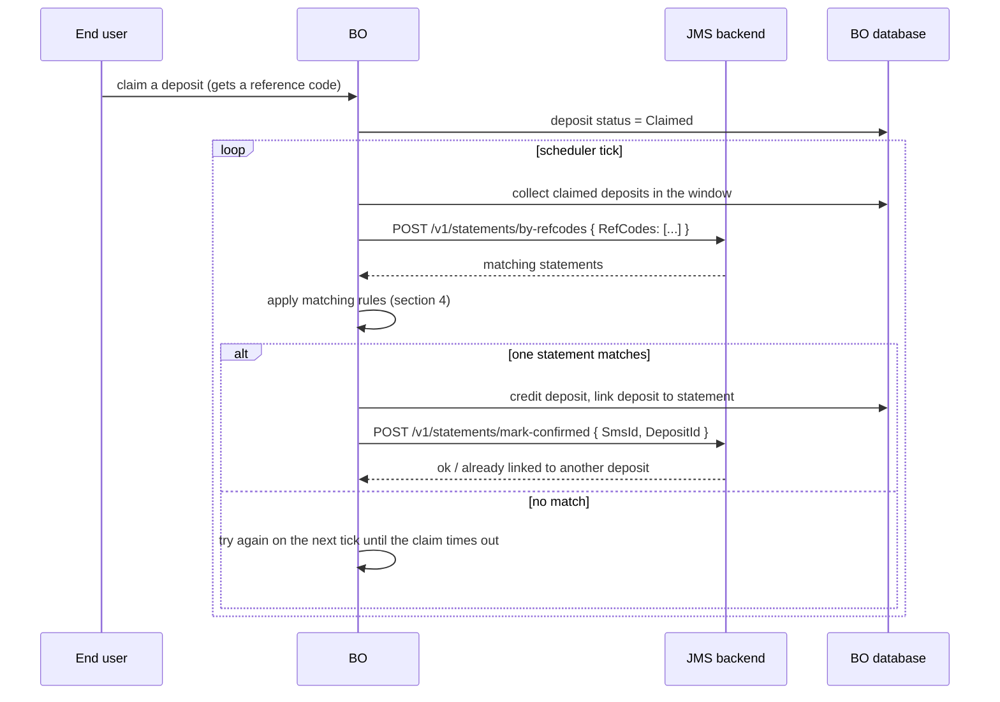

# 05 · Deposit Confirmation — the money path

This is the flow that turns a parsed SMS into credited money. It is the most sensitive contract between the BO and the new backend.

**Agreed split**: the new JMS backend **stores** SMS and SMS-confirmation records. The **BO keeps the matching logic** and remains the only place that credits a deposit. The BO pulls candidate statements by reference code.

---

## 1. Target design (build this)

Two endpoints are required, not one:

1. **read by reference codes** — the BO asks for statements;
2. **mark confirmed** — the BO tells the backend which statement was consumed by which deposit.

The second exists so that a statement can never be used twice. The BO has its own link table, but a second guard on the owner of the data is what makes double-crediting impossible when the BO retries, and it is what lets support answer "was this SMS already used, and for what?".

A third, read-only endpoint for reconciliation is requested in §6.

---

## 2. How it works today (for reference and for the dual-run period)

Three paths exist in the current code. Knowing which is live matters for cutover.

| Path | Trigger | Mechanism | Live in production? |
|---|---|---|---|
| **A. Push per SMS** | every new statement | the service posts one statement to the BO | **no** — disabled in code |
| **B. Pull per account** | BO scheduler **every 15 seconds** | the BO asks the service to deliver statements for the accounts behind currently running deposits; the service then posts a batch back to the BO | **yes, this is the live path** |
| **C. Pull by reference code** | BO scheduler | the BO sends a batch of up to 50 reference codes and reads matching statements back synchronously | code exists, **not scheduled in production** |

Path C is the shape agreed for the new design. Four things must be settled on the BO side before it becomes the only path:

* it currently **does not write back** the confirmation, so the statement's deposit link is never set on the service side — the new contract adds `mark-confirmed`;
* it must be added to the production scheduler, and the 15-second path B job retired at the same time;
* its confirmation branch still carries a debug-only guard that skips the database write in non-release builds; that must be removed before it is scheduled;
* **it applies one pairing condition that the live path does not** — see §4. Switching paths therefore changes which deposits match, and the two must be compared side by side before cutover.

Path B also has a quirk worth knowing during dual-run: the BO drops any statement whose id already appears in its link table, so re-delivery is safe.

---

## 3. Configuration that drives the flow

Per master merchant and bank code, the BO stores:

| Field | Default | Meaning |
|---|---|---|
| `IsEnable` | — | whether SMS confirmation is active for this tenant and bank |
| `MinConfirmAmount` | 30 | statements below this are ignored |
| `MaxConfirmAmount` | 10000 | statements above this are ignored |

A platform-level maximum (`MaxAmountSMSConfirm`, default 10000) also caps the deposit amount eligible for automatic confirmation.

There are also two configured lists of master merchants that are skipped by automatic confirmation, but note their scope: they gate the **bank-statement** and the **bank-notification** pipelines respectively, not the SMS pull paths described here. They are mentioned so the new backend does not assume a single global exclusion list exists; the BO will supply the authoritative list of tenants for which SMS confirmation must stay off.

This configuration **stays on the BO**. Today the BO also pushes it to the service, which no longer reads it; that push can be dropped.

---

## 4. Matching rules (kept on the BO — documented so both sides agree)

Statement side filters:

* amount within `[MinConfirmAmount, MaxConfirmAmount]` for that tenant and bank;
* reference codes already used by a confirmed deposit are excluded;
* only statements marked valid are returned by the reference-code endpoint.

Deposit side filters:

* status is `Claimed`;
* the claim has not timed out;
* amount within the platform cap;
* highest deposit id first.

Pairing conditions — **note that they are not identical on the two paths**:

| # | Condition | Live path (B) | Target path (C) |
|---|---|---|---|
| 1 | `deposit.TransactionCode == statement.RefCode` | yes | yes |
| 2 | `deposit.Amount == statement.Amount` — **exact equality** | yes | yes |
| 3 | `statement.TransferredTime - 6h < deposit.ClaimedTime` — the SMS time is Bangladesh local, so six hours are subtracted to compare it with UTC; the transfer must have happened **before** the claim | yes | yes |
| 4 | the statement's bank must be the paired bank of the account, **and** the account phone must equal the statement phone. Paired codes: `BDTC↔BDT`, `UPAYC↔UPAY`, `ROCKETC↔ROCKET`, `BKASHC↔BKASH`, `NAGADC↔NAGAD` | **no** | **yes** |
| 5 | a matched statement leaves the candidate set — one deposit consumes one statement | yes | yes |

Condition 4 is therefore a **new restriction** that takes effect when the target path goes live: a statement that the current path would accept can be rejected by the new one. The BO will run both paths against the same data and reconcile the difference before switching.

On success the BO, in one transaction: checks that the statement is not already linked and that the reference code was not refunded, inserts the deposit-to-statement link, sets the deposit to Successful with a note naming the statement id, records the reference code as consumed, notifies the cashier socket, and then calls the backend's `mark-confirmed`.

Rule 3 is the reason the **timestamp semantics in §5 matter so much**: if the new backend changes what "transfer time" means, deposits silently stop matching.

---

## 5. Contract

Names below are proposals; field names on the right of each row are what the BO currently produces or consumes and should be preserved in meaning.

### 5.1 Read statements by reference code

`POST /v1/statements/by-refcodes`

Request:

| Field | Type | Notes |
|---|---|---|
| `RefCodes` | string[] | up to 50 per call today; uppercase, trimmed |
| `SystemCode` | string | tenant environment, if the backend is multi-tenant on one host |

Response: array of statements.

| Field | Type | Meaning |
|---|---|---|
| `SmsId` | long | **stable identifier of the statement**; the BO stores it and uses it for deduplication |
| `BankCode` | string | uppercase |
| `PhoneNumber` | string | collecting SIM |
| `Amount` | decimal | signed; positive means money in |
| `RBalance` | decimal | balance reported by the bank |
| `Fee` | decimal | |
| `TransactionCode` | string | reference code, uppercase |
| `TransferredTime` | datetime | **bank local time**; see §5.4 |
| `CreatedTime` | datetime | when the backend stored it |
| `Content` / `EmbedData` | string | raw SMS body, for support |
| `MerchantCode`, `MasterMerchantCode` | string | tenant |
| `IsValid` | bool | false when flagged by the balance-consistency check and not yet approved |
| `DepositId` | long | `0` when not yet consumed, otherwise the deposit that consumed it |

### 5.2 Mark a statement confirmed

`POST /v1/statements/mark-confirmed`

| Field | Type |
|---|---|
| `SmsId` | long |
| `DepositId` | long |
| `ConfirmedAtUtc` | datetime, optional |

Required semantics:

* **idempotent**: repeating the same `(SmsId, DepositId)` succeeds;
* **conflict-aware**: the same `SmsId` with a *different* `DepositId` must be refused with a distinguishable error, not silently overwritten. The BO currently raises an operator alert when this happens, and will keep doing so;
* the outcome must be queryable afterwards (§6).

### 5.3 Errors

The BO needs to distinguish, at minimum:

| Situation | Required distinction |
|---|---|
| no statements for these reference codes | empty result, not an error |
| backend unavailable or timing out | retryable error — the BO retries on the next tick |
| statement already linked to another deposit | **non-retryable conflict**, raises an operator alert |
| malformed request | non-retryable |

The BO's current client treats any HTTP error as "try again next tick", so a conflict must be expressed in the response body rather than as a generic failure.

### 5.4 Time semantics — read this twice

* `TransferredTime` is parsed out of the SMS body and is **bank local time (UTC+6 for Bangladesh)**. It is not UTC today.
* The BO subtracts six hours from it before comparing with the claim time.
* `CreatedTime` and every other timestamp are UTC.

Preferred target: the new backend returns **both** an unambiguous `TransferredTimeUtc` and the original local value plus its offset. The BO will migrate to the UTC field. Changing the meaning of the existing field without renaming it would break matching silently, which is the worst possible failure mode here.

---

## 6. Additional endpoints the BO asks for

| Endpoint | Why |
|---|---|
| `GET /v1/statements/confirmations?refCode=` or `?from=&to=` | support and reconciliation: "which statement confirmed this deposit, and when" — today this requires a database query by an engineer |
| `POST /v1/statements/search` | the BO pages in `04-auth-user-ops.md` §7, items 1 to 3: by account, merchant, phone, reference code, date range, validity, with paging |
| `POST /v1/statements/approve` | operator approval of statements flagged by the balance-consistency check. Only meaningful once the flag is persisted — see `01-sms-ingest.md` §6 |

---

## 7. Cutover and parity

1. **Dual-run**: while both backends receive traffic, the BO reads from both and logs differences per reference code and day. A statement present in one and missing in the other is a blocker.
2. **Parity criterion**: 100 % agreement on confirmed deposits for at least 7 consecutive days, with the same statement chosen for each deposit.
3. **Order of migration**: ping first (it gates deposit routing), then ingest, then confirmation, then the operator read APIs. Ping is the one whose failure stops the business immediately.
4. **Rollback**: keep the old service able to serve reads for the whole dual-run window, and keep its database read-only for at least six months afterwards.
5. **Idempotency during replay**: if the new backend re-parses stored raw SMS (for example after a parser fix) it must keep the same `SmsId` for the same source SMS, or expose the regenerated id together with the previous one. The BO deduplicates on `SmsId`; changing ids on a re-parse would make the BO treat old statements as new ones.
