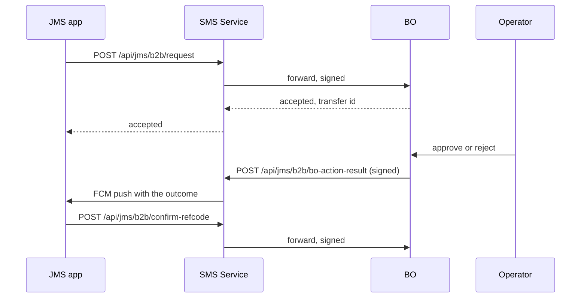

# 06 · API matrix — BO / Devsite ↔ SMS Service

Complete inventory of the integration surface, both directions, so the new backend can plan what to build and the BO can plan what to rewire. Secret **names** are given; values are not.

---

## 1. Signature schemes in use today

Four different schemes coexist. The new backend should expose **one** scheme for service-to-service traffic.

| Scheme | Construction | Carried in | Used for |
|---|---|---|---|
| Hourly hash | `MD5(sharedSecret + yyyyMMddHH_UTC)`, valid within two hours | headers `X-BO-Signature`, `X-BO-DateTime` | user administration |
| Appended hash | `SHA256(concatenatedFields + sharedSecret)` | a `Signature` field in the body | OTP hook, Telegram reset, scam list, B2B callback |
| App-version hash | `SHA256(appKey + sharedSecret + "\|jms-app-version")` | header `X-JMS-Signature` | polling the app version from the BO |
| B2B forward hash | `SHA256(agentPhone + deviceId + sharedSecret)` | header `X-JMS-B2B-Forward-Signature` | forwarding B2B requests to the BO |

A large part of the traffic below carries **no authentication at all** and relies on network placement. Those rows are marked *none*.

---

## 2. Direction 1 — BO / Devsite calls the SMS Service

### 2.1 Called straight from the operator's browser (to be removed)

These pages embed the service host and, for user administration, an hourly signature rendered into the HTML. **After cutover all 18 of these calls move behind the BO**: the browser will call the BO, and the BO will call the new backend server-side with a service credential. The new backend therefore does not need to serve browsers, issue browser-facing tokens, or configure CORS for BO pages — it only needs equivalent read APIs for those pages — see §7 below.

| Endpoint | Auth today | Page |
|---|---|---|
| `POST /api/sms/fetch-account-sms` | none | Account SMS |
| `POST /api/sms/fetch-merchant-sms` | none | All Account SMS |
| `POST /api/export/merchant-sms` | none | All Account SMS, Excel export |
| `POST /api/sms/fetch-sms` | none | Public SMS Manage |
| `POST /api/sms/fetch-sms-message` | none | Public SMS Message (raw bodies) |
| `POST /api/sms/test/parse` | none | SMS Parser, and the two pages above |
| `POST /api/device/fetch-merchant-devices` | none | Device |
| `POST /api/export/merchant-devices` | none | Device, Excel export |
| `POST /api/device/fetch-dev-site-devices` | none | Device Manage |
| `POST /api/device/reset2` | signature accepted but not verified | Device Manage, force reset |
| `POST /api/user/fetch` | hourly hash | SMS User |
| `POST /api/user/create` | hourly hash | SMS User |
| `POST /api/user/change-status` | hourly hash | SMS User |
| `POST /api/user/change-password` | hourly hash + secret in body | SMS User |
| `POST /api/user/change-user-config` | hourly hash | SMS User |
| `POST /api/user/change-user-config-bulk` | hourly hash | SMS User |
| `POST /api/user/change-user-config-by-master-code` | hourly hash | SMS User |
| `GET /api/user/fetch-active-master-codes` | hourly hash | SMS User |

### 2.2 Proxied through the BO

A generic forwarding endpoint on the BO relays `/api/proxy/sms/{path}` to the service. It is used by the SMS Template page for `all`, `add`, `edit` and `parse-test`. It forwards any path and copies client headers, so the new integration should use explicit, whitelisted server-side calls instead.

### 2.3 Called by the BO server or its schedulers

| Endpoint | Caller | Auth today | Purpose |
|---|---|---|---|
| `POST /api/user/create` | BO server | hourly hash | create the service user behind a leader account |
| `POST /api/user/change-password` | BO server | hourly hash | leader password change |
| `POST /api/user/change-status` | BO server | hourly hash | leader disable / delete |
| `POST /api/sms/UpdateSmsTransactions` | scheduler, every 15 s | none | ask the service to deliver statements for given accounts (live confirm path) |
| `POST /api/sms` | BO server | none | fetch statements for one reference code |
| `POST /api/sms/v2/fetch-sms` | scheduler (not enabled in production) | none | fetch statements for a batch of reference codes |
| `POST /api/sms/confirm-sms` | BO server | none | write back `{ DepositId, SmsId }` |
| `POST /api/sms/fetch-sms` | BO server | none | backing call for BO statement APIs |
| `POST /api/sms/approve-scam-sms` | BO server | none (check disabled) | approve flagged statements |
| `POST /api/SmsDepositConfig/update` | BO server | none | push confirm configuration (service no longer reads it) |
| `POST /api/device/telegram-reset-device` | BO, Telegram bot | appended hash | reset a device from chat |
| `POST /api/export/merchant-sms` (export host) | BO export job | none | scheduled Excel export |
| `POST /api/notification/send` | BO server | none | push notification |
| `POST /api/notification/resend` | BO server | none | retry failed recipients |
| `POST /api/notification/edit` | BO server | none | edit and re-deliver |
| `POST /api/notification/get-by-id`, `get-by-ids` | BO server | none | read |
| `POST /api/notification/get-statistics` | BO server | none | counters |
| `POST /api/notification/get-recipients` | BO server | none | recipient list |
| `POST /api/jms/b2b/bo-action-result` | BO server | appended hash | operator approved or rejected a B2B transfer; the service pushes the result to the device |

---

## 3. Direction 2 — the SMS Service calls the BO

These are the BO endpoints the **new backend will have to call**. The BO will keep serving them, with authentication added.

| BO endpoint | When | Auth today | Payload |
|---|---|---|---|
| `POST /api/SMS/HookBDTPhoneSMS` | an SMS could not be parsed (OTP and unknown messages) | appended hash on `Phone` | `{ Phone, Messages: [{ Sender, Message, Timestamp(seconds) }], Signature }` |
| `POST /api/account/ping` | every ping batch flush | **none** | `{ PhoneNumber, MerchantCode, LastPingTime, UIVersion }` |
| `POST /api/account/verify-bo-account` | device activation | **none** | `{ PhoneNumber, MerchantCode }` → `{ IsSuccessful, Message }` |
| `POST /api/leader-account/ping-event` | leader heartbeat, and device sign-out cleanup | **none** | `{ Username, MasterCode, DeviceId, DeviceName, IP, LastPingTime }` |
| `POST /api/schedule-notice/notice-callback` | after a push notification is delivered | **none** | `{ NotificationId, MerchantCode, Status, TotalDevices, SuccessCount, FailedCount, ReadCount }` |
| `GET /api/jms-app/version?appKey=` | every 60 s | `X-JMS-Signature` | → `{ isSuccessful, data: { VersionCode, MinVersionCode, IsForceUpdate, IsForceLogout, ApkVersion, ApkTimestamp } }` |
| `POST /api/jms/b2b/request` | app creates a B2B transfer | B2B forward hash | `{ TxnId, MerchantCode, AgentPhone, DeviceId, FCMToken, AccountNumber, BankCode, Currency, B2BType, RequestAmount, Description }` |
| `POST /api/jms/b2b/confirm-refcode` | app submits the reference code | B2B forward hash | `{ TxnId, MerchantCode, RefCode, AgentPhone, DeviceId }` |
| `POST /api/jms/b2b/history` | app lists transfers | B2B forward hash | filter |
| `POST /api/jms/b2b/check-status` | app polls a transfer | B2B forward hash | `{ TxnId, MerchantCode }` |
| `POST /api/sms/delivery` | statement batch delivery (live confirm path B) — **legacy, retired in phase 1; do not reimplement** | **none** | `{ MerchantCode, PhoneNumber, BankCode, AccountId, SMSTransactions[] }` |
| `POST /api/sms/processed` | single statement push | **none** | disabled in code today |

All BO endpoints in this table currently sit on a controller base that disables authentication; they are protected only by network placement. **Both teams should agree on one scheme before the new backend starts calling them**.

---

## 4. B2B transfer flow

The state machine lives on the BO; the service is a signed forwarder plus a push channel, and it keeps a request log. The new backend needs: the four forwarding endpoints, one inbound callback endpoint, and FCM delivery. The BO must be told the new callback URL per environment.

---

## 5. Configuration keys

**On the BO** (names only): service host, internal service host, export host, notice API host, shared secret for user administration, app-version secrets per app key, S3 prefix and public APK base URL, B2B operation-balance secrets, B2B callback URL, account-device secret, and lists of master merchants excluded from SMS or notification confirmation.

**On the service**: database connections, BO host, BO OTP host, IT site host, two shared secrets, Telegram group ids (general and per-tenant scam groups), disconnect threshold, "verify BO account" switch, "verify sender" switch, hot/cold cutover settings, Firebase credentials, and the app-version block (ping gate source, BO host, public base URL, S3 prefix and folders, app keys, download concurrency limits, object storage credentials).

These are currently stored in configuration files committed to the repository. The new deployment should take them from a secret manager, with **distinct values per environment** — several are shared between internal and reseller today.

---

## 6. Endpoints with no caller

Candidates for removal rather than reimplementation. Confirm before dropping, since a caller may live outside this repository.

| Endpoint | Note |
|---|---|
| `POST /api/DepositMatch/compare-sms` | compares by a field that is always empty on the SMS path, so it can never match |
| `GET /api/bot/get-valid-message` | OTP lookup; the Telegram bot that calls it is outside this repository — **confirm before dropping** |
| `POST /api/sms/fetch-scam-sms` | no caller found in the BO |
| `POST /api/Device/find-devices-by-phone` | returns device secrets; must not be reproduced in this form |
| `POST /api/Device/ping-sms-test`, `test-active-device`, `CheckEnviroment` | diagnostics |
| `GET /api/SmsTesting/*`, `GET /api/Test/*` | test scaffolding; one of them enqueues a real job |
| `POST /api/export/merchant-sms/v3` | marked as old in the code |
| BO `api/sms/fetch-all-sms`, `fetch-all-account-sms`, `approve-scam-sms` | no caller inside this repository |
| BO configuration entry pointing at `/api/sms/fetch-all` | that route does not exist on the service; it is misconfigured in every environment |

---

## 7. What the new backend must expose, consolidated

| Group | Endpoints |
|---|---|
| **Device and app** | activate, ping, sign-out, reset, version, APK download |
| **Ingest** | SMS ingest (and push-notification ingest if the app consolidates channels) |
| **Auth** | login, user config read |
| **Deposit confirm (BO)** | statements by reference codes, mark confirmed, confirmation lookup |
| **Read for BO pages** | statement search, raw message search, device search, parse test, export |
| **Administration (BO)** | user create / status / password / config (single, bulk, by master code), active master codes, device reset, statement approval |
| **Metrics (BO)** | ingest counts and daily series per merchant, unparsed rate |
| **Notifications** | send, edit, resend, read, statistics, recipients, plus the delivery callback to the BO |
| **B2B** | four forwarders plus one inbound callback |
| **Telegram support** | latest message lookup for a phone, device reset |
| **Chat** (if it ships) | send, history, internal push endpoint |
