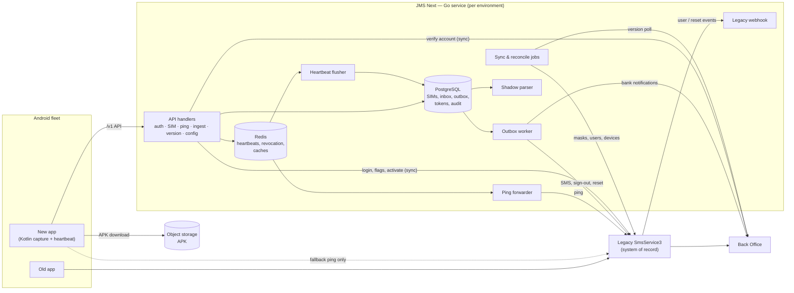
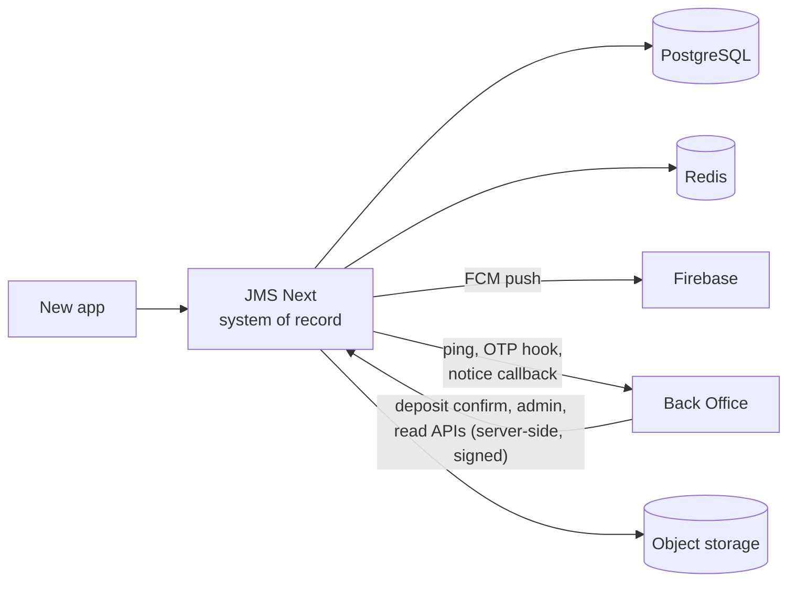
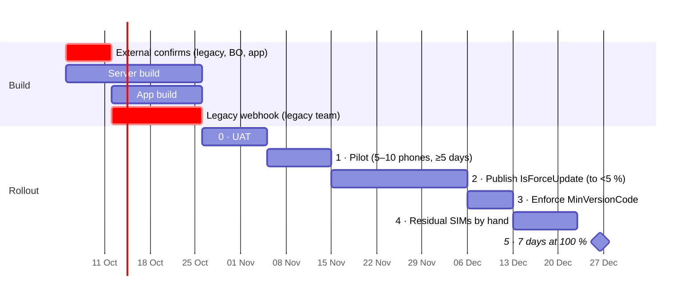

# JMS Next — Overview

| | |
|---|---|
| **What** | One-page summary of the new JMS backend (Go) and new Android app: the idea, the architecture, the hardware, the timeline |
| **Sources** | `plans-next-architecture/` (the plan), `JMS-Handover/` (how legacy works today), and the earlier Notion overview (§6) |
| **Detail** | Not here. Every section links to the file that owns the detail |

---

## 1. Why

Merchants run Android phones with bank SIMs. The JMS app reads bank **SMS** and bank-app **notifications**, uploads them, and sends a **heartbeat (ping)** every minute. The Back Office (BO) matches those statements against claimed deposits and credits the player.

Money depends on three things staying alive: **SMS ingest, ping, and deposit confirmation**. Today all of that runs through `SmsService3` (.NET, "legacy"), which has unauthenticated routes, a shared version source for both environments, fire-and-forget delivery, and no audit trail. The goal is to replace it with a new Go service **without breaking the BO, the Devsite, or the phones already in the field**.

## 2. The main idea

**Build a new front door first, retire legacy later.**

1. **New app → new service only.** The new app gets a clean API (`/v1/...`, Bearer JWT, one error envelope). It never copies legacy routes or bare `"0000"` codes.
2. **Passthrough during coexistence.** The new service forwards every call to legacy or the BO, so they see a new-app phone exactly like an old-app phone. Legacy and the BO keep **every decision they make today** (deposit routing, crediting, users, flags, push).
3. **Old app is untouched.** Both apps run side by side until every SIM is on the new app.
4. **Store everything, decide nothing (yet).** The new service keeps its own copy of SIMs, heartbeats, SMS, and notifications, and runs a **shadow parser** whose output is compared daily with legacy (parity report). That data makes the later takeover possible.
5. **Nothing acknowledged is ever lost.** HTTP 200 on money evidence means "committed here + queued in the outbox". Delivery is at-least-once to idempotent targets.
6. **In-place upgrade.** Same application id, signing key and **device id** as the old app, so the new build installs as an update through the existing force-update prompt.
7. **Internal and Reseller are fully separate deployments.** No shared DB, host, or secret.

## 3. Architecture

### 3.1 Coexistence (what we ship now)

| Flow | How it works | Detail |
|---|---|---|
| **Login** | Password checked by legacy; new service issues its own ES256 JWT bound to device id; stores only refresh-token hashes | `05-user-login.md` |
| **SIM activate** | Bound on **both** backends (BO verify → legacy activate → local row). Legacy still enforces one SIM per device across both apps | `06-sim.md` |
| **Ping** | Written to Redis, flushed to Postgres every 45 s, latest heartbeat forwarded to legacy (or the phone pings legacy itself — one switch, never both) | `04-device-ping.md` |
| **SMS / notification ingest** | Signed request → inbox row + outbox item in one transaction → forwarded to legacy / BO, who confirm deposits as today | `07-sms-noti-ingest.md` |
| **Version & config** | Polls BO JMS Manage every 60 s; APK via presigned URL; remote config pushed through `X-Config-Version` on every ping | `08`, `09` |
| **Staying in sync** | Outbox (ordered per SIM, retries forever, parks bad items), legacy webhook for user/reset events, hourly + 15-min reconcile | `10-legacy-bridge.md` |

### 3.2 Target (after legacy is retired — not yet planned in detail)

After adoption reaches 100 %, JMS Next takes over what legacy does today: deposit-confirmation APIs, BO page reads, user administration, FCM push, B2B, operator reset, and the legacy data migration. These are listed as **not written** in `00-index.md` and are gated by the parity report (7 days at 100 %).

## 4. Hardware estimate

**Baseline** (from the earlier Notion overview): **1,000 daily active devices, 100 SMS + 100 notifications per device per day, 1 ping per device per minute**. Treat it as per environment until the real Internal / Reseller split is confirmed.

### Load

| Signal | Formula | At baseline |
|---|---|---|
| Pings | devices × 1–3 loops / 60 s | ~1.44 M/day, ~17–50 req/s |
| SMS ingest | devices × 100 / day | 100 k/day, ~1.2/s avg, ~15/s peak |
| Notification ingest | devices × 100 / day | 100 k/day, same shape |
| Parsed statements | ~10 % of messages | ~10 k/day |
| Redis working set | presence + revocation + caches | < 100 MB |

The service is I/O-bound and light. **Postgres storage is the only thing that grows**, and it depends on one open decision (see §6):

| Raw SMS / notification retention | Year 1 | Year 3 |
|---|---|---|
| 30-day rolling partitions (Notion) | 35–50 GB | 50–80 GB |
| Keep all raw rows (current plan: inbox becomes system of record) | ~180 GB | ~550 GB |

Heartbeats need no history table: the current plan keeps only the latest ping per device.

### Recommended per production environment (Internal and Reseller each)

| Component | Spec | Count | Notes |
|---|---|---|---|
| JMS Go service | 2 vCPU / 2 GB | 2 (HA) | Stateless; every background loop is safe on N instances |
| PostgreSQL 16 | 2 vCPU / 8 GB / 250 GB NVMe (≥ 3,000 IOPS) | primary + 1 replica | 250 GB covers year 1 even when raw is kept. Partition by month |
| Redis 7 | 1 vCPU / 1 GB | 1 + replica (optional) | Only rebuildable data |
| Load balancer / ingress | managed, TLS 1.3 | 1 | Real client IP header |
| Object storage | existing S3 | — | APK, per-environment prefix |
| Secret manager | managed | — | All keys per environment |

**Shared:** monitoring stack (metrics, logs, alerts) 2 vCPU / 8 GB / 200 GB. **UAT:** one node with service + Postgres + Redis, 2 vCPU / 8 GB / 100 GB.

**Total (2 prod environments + shared + UAT):** ≈ **24 vCPU, 60 GB RAM, ~1.3 TB SSD**. Per prod environment: 10 vCPU / 22 GB / 500 GB.

### Scaling guide

| Active devices per env | Service | PostgreSQL | Raw growth / month (keep all) |
|---|---|---|---|
| 1 k (baseline) | 2 × 2 vCPU / 2 GB | 2 vCPU / 8 GB | ~15 GB |
| 5 k | 2 × 2 vCPU / 4 GB | 4 vCPU / 16 GB | ~75 GB |
| 20 k | 3 × 4 vCPU / 4 GB | 8 vCPU / 32 GB | ~300 GB |

## 5. ETA

### Effort (from `12-work-breakdown.md`)

| Track | Tasks | Raw estimate | Realistic (× 2.5 for review, integration, fixes) |
|---|---|---|---|
| Server | 58 tasks (foundation, bridge, login, SIM, ping, ingest, parsers, version/config, B2B, parity, dashboards) | ~42 h | ~2.5–3 weeks, 1 backend dev |
| Android app | 14 tasks | ~11 h | ~1.5–2 weeks, 1 app dev (UI rebuild not included) |

Server and app run **in parallel**. The critical path is the server plus the external confirmations below.

### Timeline

Assumes start **Mon 2026-10-05**, one backend and one app developer, and external confirmations delivered in week 1.

| Milestone | Target |
|---|---|
| Build complete | end of Oct 2026 (week 4) |
| UAT passed | mid-Nov 2026 (week 6) |
| Pilot done, public release starts | end of Nov 2026 (week 8) |
| Minimum version enforced | end of Dec 2026 (week 12) |
| **Coexistence ends (100 % adoption)** | **mid/late Jan 2027 (~week 15)** |
| Legacy retirement | not planned yet — starts after that, gated by the parity report |

### What can move the date

| Dependency | Owner | Impact if late |
|---|---|---|
| Confirm sign-out body, client-IP header, template route, device-list shape, login error body | Legacy team | Blocks `S7`, `P7`, `I2`, `B11`, `L4` |
| Emit the user/reset webhook | Legacy team | Pilot can start without it, but disabled users lag up to 1 h |
| Confirm notification-ping route, verify-account phone form, Reseller version source | BO team | Blocks `P8`, `S4`, `V1` for Reseller |
| Allow the new service's egress IPs | BO team | Blocks UAT |
| Same package/signing key/device id, B2B + V1 notification scope | App team | Blocks every upgraded phone if wrong |
| Pilot phones, phase-3 announcement, residual owner | Operations | Stretches phases 1, 3, 4 |

The biggest unknown is **phase 2** (how fast operators accept the update prompt). It is sized at 3 weeks; it ends when `legacyOnlySims` drops below 5 %.

## 6. Differences from the earlier Notion overview

The earlier overview ([JMS Next-Generation Architecture](https://ryeng.notion.site/JMS-Next-Generation-Architecture-3ddaa9f02ce6808688f6e70871dd7447)) and `plans-next-architecture/` agree on the shape: one Go modular monolith, PostgreSQL + Redis, a single ingress, server-driven config, the new app talking only to Go, forwarding to legacy during a dual run, and a shadow parser with a parity check. They differ on the points below. **`plans-next-architecture/` is the source of truth** (`01-principles.md`). Each row is either already settled by the plan, or a gap to decide.

### Settled by the plan (Notion version superseded)

| Topic | Notion | Current plan | Why the plan differs |
|---|---|---|---|
| Upload signing | ECDSA P-256 in Android Keystore, canonical string with nonce | Device secret per SIM, SHA-256 over device id + phone + sender + time + **SHA-256(content)** | Covers the body (the core flaw), no key-enrolment flow, and deduplication makes a replay harmless, so no nonce store |
| Operator auth | OAuth2 PKCE, 15-min access JWT | Password checked by legacy, ES256 JWT (24 h access, 30-day rotating refresh) bound to device id | Users stay in legacy during coexistence. PKCE adds nothing for a first-party app with a password grant |
| Forward mode | SMS and notifications **synchronous** (proxied response) | **Transactional outbox**, async, retries forever, ordered per SIM | A legacy outage must not fail or lose an upload. 200 means committed here |
| Ping to legacy | App-side dual dispatch, async fan-out | One switch: server forwarder **or** phone, never both | Both would double-notify the BO. Neither would drop deposit routing in 10 minutes |
| Heartbeat storage | Partitioned 7-day history table | Latest value only (Redis → `sim_device`) | Nothing reads history during coexistence |
| Version | Checked in own DB | Polls BO JMS Manage, same app key as the old app | One publish reaches both apps |
| Scope of Go | Also owns ledger, B2B state machine, parser output used live | Stores and forwards. Legacy and the BO keep every decision | Minimise risk until parity is proven |

### Gaps: in Notion, missing from the plan (decide before build)

| Gap | Notion | Plan today | Impact |
|---|---|---|---|
| **Operator screens: balance, accounts, statements, leader info / accounts / balance** | `/v1/ledger/*`, `/v1/leader/*` proxied to BO with the legacy `SECRET_KEY` | No route. Rule 1 says the new app calls only this service | **The new app cannot show these screens.** Needs ~6 passthrough routes (≈ +1 week), and the bundled `SECRET_KEY` moves server-side |
| Operations dashboard | Fleet grid, live SSE message stream, re-parse tool, parity inspector | Metrics, alerts, daily parity report only | Ops still cannot diagnose without the device. Could be a phase-2 item |
| App log shipping (Seq) | `/api/events/raw` proxy, TLS only | Not mentioned | The old app forces cleartext HTTP for Seq. Decide: proxy, or drop Seq from the new app |
| Phone vitals | Battery, temperature, charger, signal in ping | Ping body is `fcmToken` only | Add optional fields now. They are cheap |
| Offline spooler | Room SQLite queue in the Kotlin daemon | The plan requires a durable queue and drains the old one, but does not name the store | Align the app team on Room/SQLite |
| Raw retention | 30 days rolling, statements kept forever | Inbox kept, since it becomes the system of record | Drives storage about 4× in year 1 and 7–10× by year 3 (§4). Decide before the first partition layout |
| V1 notifications, B2B | In the matrix | Marked **Confirm** / passthrough only | Confirm scope with the app team |

If the operator-screen passthrough is added, the ETA in §5 moves by about one week, all in the build phase.
