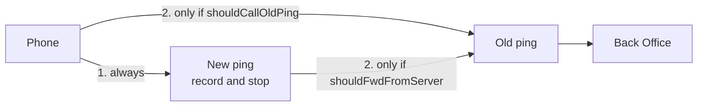

# Start here

| | |
|---|---|
| **Status** | `01`–`07` written · `08`–`09` placeholders |
| **Read this when** | You need the map before opening a topic file |
| **Time** | ~5 minutes on this page only |

Read this page first. If you only have five minutes, stop at the end of it. Open another file only when you are about to build that piece.

## The system in one minute

Phones send a heartbeat to a Go service. That service records it and stops.

The Back Office still needs to know a phone is alive before it will route deposits to that SIM. That notice is a second, older call. It runs only when a flag is on.

The flag has two names and one meaning.

| Who reads it | Name | What they do when it is on |
|---|---|---|
| The phone | `shouldCallOldPing` | After the new ping succeeds, the phone calls the old ping API |
| This service | `shouldFwdFromServer` | After it stores the new ping, the service calls the old ping API |

> **Dual-run rule:** Turn the flag on in **one place only** — phone **or** server, not both. Both on notifies the Back Office **twice**.

App version is a different API. Ping does not check it. Placeholders: `08-version-release.md`, `09-app-remote-config.md`.

Login is in `05-user-login.md`. SIM is in `06-sim.md`. Ingest is in `07-sms-noti-ingest.md`.

## Which file to open

| You are about to… | Read | Skip |
|---|---|---|
| Remember the rules | `01-principles.md` | The endpoint tables |
| See what runs where | `02-system.md` | Field lists |
| Change the Android app | `03-mobile.md` | Server retry rules |
| Implement the ping server | `04-device-ping.md` | The mobile loop |
| Implement login | `05-user-login.md` | Ping batching |
| Implement SIM | `06-sim.md` | Ingest |
| Implement ingest | `07-sms-noti-ingest.md` | — |
| Implement version / APK | `08-version-release.md` | Placeholder only |
| Implement remote config | `09-app-remote-config.md` | Placeholder only |

## File map (placeholders)

| File | What it will be |
|---|---|
| `08-version-release.md` | App version check and APK download |
| `09-app-remote-config.md` | Server-driven base URL and dual-run flags for the app |

## Words

Use these names. Do not invent a third name for the same thing.

| Word | Means |
|---|---|
| New ping | `POST /v1/devices/ping`. Body is `signature` and `fcmToken`. Identity is in headers. Records the heartbeat in Redis. Does not call the Back Office. |
| Old ping | `POST /device/ping`. The only collector call that notifies the Back Office. |
| The flag | `shouldCallOldPing` on the phone, `shouldFwdFromServer` on the server. |
| Version API | `08-version-release.md` (placeholder) |
| Remote config | `09-app-remote-config.md` (placeholder) |

## How the rest of this folder is written

A reader gets lost when the same story is told in every file. These rules keep one path through the folder.

1. This page owns the overview. Other files do not retell it.
2. Each file answers one question, for one reader, and says so in the first lines.
3. A fact lives in one file. Other files use one sentence and a link.
4. Each file has one diagram, and that diagram is about that file only. Do not paste the same picture into the next file.
5. Tables are for fields an implementer has to get right. They come after the steps, not before.
6. A file that is not written is listed here as not written. It is not a place to hide a decision.
