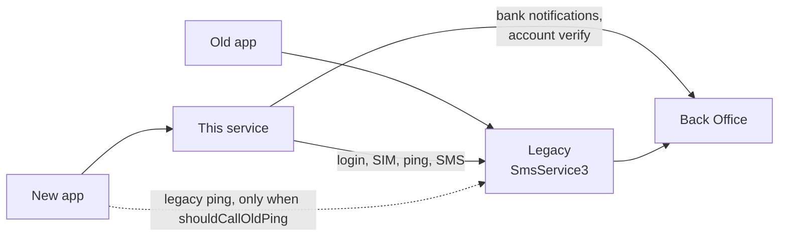

# Start here

| | |
|---|---|
| **Status** | `01`–`12` written. Topics under **Not written** are decided later, not here |
| **Read this when** | You need the map before opening a topic file |
| **Time** | ~5 minutes on this page only |

Read this page first. If you only have five minutes, stop at the end of it. Open another file only when you are about to build that piece.

## The system in one minute

Two Android apps will be in the field until every phone runs the new one. That period is **coexistence**.

- The **old app** talks to the old service (**legacy**, `SmsService3`) exactly as today. Nothing about it changes.
- The **new app** talks only to this Go service. Its API is new. It does not copy legacy routes, casing, or bare string codes.
- This service **passes calls through** to legacy, and to the Back Office for bank notifications. The Back Office sees a new-app phone exactly as it sees an old-app phone today.

During coexistence, legacy stays the system of record for everything the Back Office reads: device status, statements, deposit confirmation, push tokens, users, and flags. This service also stores what it receives, so it can take over when legacy is retired. That takeover is not planned in this folder yet.

The first launch of the new app forces a logout. The operator logs in, the app activates each SIM, and from then on every call goes through this service.

```mermaid
flowchart LR
    OLDAPP["Old app"] --> LEG["Legacy<br/>SmsService3"]
    NEWAPP["New app"] --> JMS["This service"]
    JMS -->|"login, SIM, ping, SMS"| LEG
    JMS -->|"bank notifications,<br/>account verify"| BO["Back Office"]
    LEG --> BO
    NEWAPP -.->|"legacy ping, only when shouldCallOldPing"| LEG
```

## Passthrough switches

| What | Setting on this service | Effect |
|---|---|---|
| Ping | `pingLegacyRoute` = `server` or `phone` | `server`: this service forwards every ping to legacy (`shouldFwdFromServer` is on). `phone`: the app calls legacy ping itself (`shouldCallOldPing` is on, delivered by `09`). |
| SMS | `shouldFwdSmsToLegacy`, on for all of coexistence | Each accepted SMS is forwarded to legacy |
| Bank notification | none, always on | Each accepted notification is forwarded to the Back Office |
| Login, user flags, SIM | none, always on | Synchronous calls to legacy |

> **Ping rule:** one setting produces both flag names, so exactly one side forwards. Both on would notify the Back Office twice. Both off would stop deposits routing to every new-app phone within 10 minutes. `none` is allowed only after legacy retirement.

## Which file to open

| You are about to… | Read |
|---|---|
| Remember the rules | `01-principles.md` |
| See what runs where, and what is stored | `02-system.md` |
| Change the Android app | `03-mobile.md` |
| Implement ping | `04-device-ping.md` |
| Implement login, tokens, flags | `05-user-login.md` |
| Implement SIM activate, sign-out, reset | `06-sim.md` |
| Implement SMS and bank-notification ingest | `07-sms-noti-ingest.md` |
| Implement version check and APK | `08-version-release.md` |
| Implement remote config for the app | `09-app-remote-config.md` |
| Implement the outbox, webhook, reconcile jobs | `10-legacy-bridge.md` |
| Plan the release and adoption | `11-rollout.md` |
| Pick up a task | `12-work-breakdown.md` |

## Not written

These are needed to **retire legacy**, not to ship the new app. Do not specify them inside the files above.

| Topic | Why it can wait |
|---|---|
| Deposit confirmation served by this service (`by-refcodes`, `mark-confirmed`) | The Back Office keeps pulling from legacy, which receives every SMS through passthrough |
| Back Office read APIs (statements, raw SMS, devices, export, metrics) | BO pages keep reading legacy |
| User administration API (create, status, password, flags) | Users stay in legacy. Login passes through |
| Outbound push (FCM) and notice callback | Legacy pushes. Ping passthrough keeps its FCM tokens current |
| B2B served natively | Passthrough only, see `10-legacy-bridge.md` |
| Operator reset API on this service | Operators reset on legacy. This service follows through `10` |
| Legacy data migration and shutdown | After adoption reaches 100 % (`11`) |
| Chat | Not in production |

## Words

Use these names. Do not invent a third name for the same thing.

| Word | Means |
|---|---|
| Legacy | `SmsService3`, the current .NET service. Routes start with `/api/`. |
| Coexistence | From the first new-app release until no SIM is left on the old app |
| Passthrough | This service calling legacy or the Back Office on the app's behalf |
| New ping | `POST /v1/devices/ping`, `/v1/leaders/ping`, `/v1/noti-devices/ping` on this service |
| Legacy ping | Legacy `POST /api/Device/ping`, `/api/leader-account/ping`, and the Back Office notification ping |
| Ping route | The `pingLegacyRoute` setting. The phone sees it as `shouldCallOldPing`, this service as `shouldFwdFromServer` |
| Outbox | The durable queue for passthrough calls, `10-legacy-bridge.md` |
| Device secret | Secret issued by this service at activation. Signs SMS ingest |
| Legacy secret | Secret legacy issued for the same SIM. Held by this service only, used to sign forwarded SMS |

## How the rest of this folder is written

A reader gets lost when the same story is told in every file. These rules keep one path through the folder.

1. This page owns the overview. Other files do not retell it.
2. Each file answers one question, for one reader, and says so in the first lines.
3. A fact lives in one file. Other files use one sentence and a link.
4. Each file has one diagram, and that diagram is about that file only.
5. Tables are for fields an implementer has to get right. They come after the steps, not before.
6. A topic that is not written is listed above as not written. It is not a place to hide a decision.
7. A value marked **Confirm** comes from a system this folder does not own. Confirm it with the owner before building on it.
