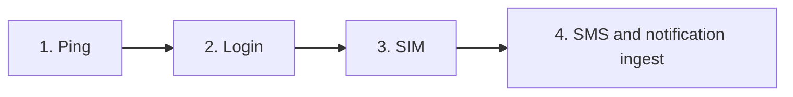

# 01 · Principles

| | |
|---|---|
| **For** | Anyone about to add a decision |
| **Answers** | Which rules later pages are not allowed to break |
| **Overview** | `00-index.md` — no ping walkthrough here |

## Plan rules

> **Source of truth:** This folder is the only plan. Do not cite or quote another plan. If a decision is not in these files, it is not decided.

When a later file disagrees with this one, edit this one first.

## Product rules

The Go service is the server the phone talks to. The Back Office still chooses which account can take a deposit, and it still credits the player.

Internal and Reseller are separate deployments. They do not share a database, a host, or a config value.

Build in this order. Ping does not wait for the later items.

| Order | Topic | File |
|---|---|---|
| 1 | Device ping | `04-device-ping.md` |
| 2 | User login | `05-user-login.md` |
| 3 | SIM binding | `06-sim.md` |
| 4 | SMS and notification ingest | `07-sms-noti-ingest.md` |

Deposit confirmation, outbound push, B2B, operator screens, and retention have no file yet. Do not specify them inside the files that do exist.

## Behaviour rules

These are the constraints. The steps live in the file named on the right.

| Rule | Where the steps are |
|---|---|
| A new ping records the heartbeat and does not call onward. The old ping is the onward call. Device, leader, and notification pings share that split. The flag is the one in the index. | `04-device-ping.md` |
| Ping does not accept or reject an app version. | Version API, not written |
| Login is forwarded. This service issues tokens and does not store a second user. Ping does not require a token. | `05-user-login.md` |
| One SIM is bound to one device. The secret on the row is opaque. Ping does not create device rows. | `06-sim.md` |
| Signed requests use the values as sent in the request, not the normalised phone used for lookup. | `04-device-ping.md`, `06-sim.md`, `07-sms-noti-ingest.md` |
