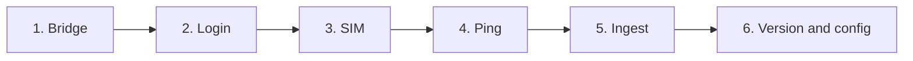

# 01 · Principles

| | |
|---|---|
| **For** | Anyone about to add a decision |
| **Answers** | Which rules later pages are not allowed to break |
| **Overview** | `00-index.md` |

```mermaid
flowchart LR
    B["1. Bridge"] --> L["2. Login"] --> S["3. SIM"] --> P["4. Ping"] --> I["5. Ingest"] --> V["6. Version and config"]
```

## Plan rules

> **Source of truth:** This folder is the only plan. `JMS-Handover/` describes legacy as it is. It is evidence, not a plan. If a decision is not in these files, it is not decided.

When a later file disagrees with this one, edit this one first.

## Product rules

1. **The new app talks only to this service.** The only exception is the legacy ping, when the ping route is `phone` or during the fallback in `09`.
2. **The old app is untouched.** This service does not serve legacy routes, PascalCase bodies, or bare `"0000"` codes.
3. **Legacy and the Back Office keep every decision they make today.** They choose which account takes a deposit, credit the player, own users and flags, own SMS templates, and push to devices.
4. **Nothing is done twice.** This service does not call the Back Office or Telegram for anything legacy already does for the same event. The one exception is Back Office account verification at activation, which is done here to tell an outage from a rejection.
5. **HTTP 200 on money evidence means delivery.** For SMS and bank notifications, 200 means the item is committed here and the outbox will deliver it to its target.
6. **The upgrade happens in place.** The new app uses the same application id, signing key, and device id as the old app.
7. **Internal and Reseller are separate deployments.** They do not share a database, a host, or a secret.

## Build order

All six ship before the first new-app release. Ping comes after SIM because a ping needs an activated SIM and a token.

| Order | Topic | File |
|---|---|---|
| 1 | Legacy bridge: clients, outbox, webhook | `10-legacy-bridge.md` |
| 2 | Login and tokens | `05-user-login.md` |
| 3 | SIM on both backends | `06-sim.md` |
| 4 | Ping | `04-device-ping.md` |
| 5 | SMS and notification ingest | `07-sms-noti-ingest.md` |
| 6 | Version and remote config | `08-version-release.md`, `09-app-remote-config.md` |

The release plan is in `11-rollout.md`. Tasks are in `12-work-breakdown.md`.

## Behaviour rules

These are the constraints. The steps live in the file named on the right.

| Rule | Where the steps are |
|---|---|
| Every app call carries a Bearer access token, except login, refresh, and version. The token is bound to `X-Device-Id`. | `05-user-login.md` |
| A ping records the heartbeat here and reaches legacy through the ping route. Ping does not check the app version. | `04-device-ping.md` |
| Login passes through to legacy. This service issues its own tokens and stores only token hashes. | `05-user-login.md` |
| Every activation happens on this service and on legacy. Legacy enforces one SIM per device across both apps. | `06-sim.md` |
| The device secret signs SMS ingest only. Pings and SIM calls use the token. | `06-sim.md`, `07-sms-noti-ingest.md` |
| Signed strings use values as sent. Lookups use the normalised phone. | `06-sim.md`, `07-sms-noti-ingest.md` |
| Anything the app must not lose goes through the outbox. The latest heartbeat goes through the ping forwarder. | `10-legacy-bridge.md`, `04-device-ping.md` |
