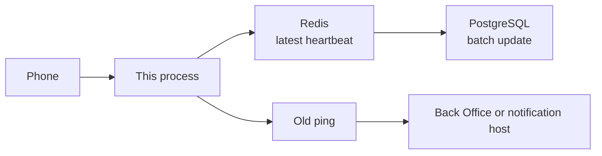

# 02 · System

**For:** someone who needs to see the processes and the data, before writing code.
**This file answers:** what runs in the ping build, and what it stores.
**The flag picture is:** `00-index.md`. This diagram is where a ping is stored.

## The ping build

One Go process per environment. The phone uses one base URL. Internal and Reseller each have their own process, database, and config.

A new ping is written to Redis first, one value per device id. A worker copies dirty keys into PostgreSQL in a batch. Redis is the buffer. PostgreSQL is the record. The old ping path is the one that calls the Back Office. It does not wait for that batch.

| Piece | Role in this build |
|---|---|
| New ping handler | Checks the signature, writes the latest heartbeat to Redis, returns. Reads `shouldFwdFromServer` only to decide whether to invoke the old handler. |
| Old ping handler | Forwards the legacy heartbeat. Device and leader go to the Back Office. Notification goes to the notification host. |
| Version API | Not in this build. |
| User store | Not in this service. |
| Payments | Not in this service. |

A device row is created by SIM activation, which is not written yet. The new ping updates a row it finds. It does not insert one.

## What is stored

| Place | What ping puts there |
|---|---|
| Redis, one key per device id | Latest heartbeat: time, FCM token, device name, build number, client IP. A newer ping replaces the key. An empty FCM token does not erase the one already stored. |
| Device row in PostgreSQL | The same fields, written by the batch worker, not by the request. |
| Leader device row | Keyed by username, master code, and device id. The first leader ping may insert it. |
| Outbox | One unsent Back Office payload per device row. Only the old ping path writes it. |

`LastPingTime` is when this service accepted the ping, in UTC.

A row counts as connected when it is logged in and `LastPingTime` is within the disconnect threshold (default 10 minutes). That is computed when a screen asks. It is not a column, and it is not the Back Office's view. The Back Office only moves when the old ping path runs.

## Configuration, per environment

Back Office base URL, database URL, Redis URL, disconnect threshold, and `shouldFwdFromServer`. The flag can change without a new binary. The phone's copy of the same flag is `shouldCallOldPing`, described in `03-mobile.md`.

## Later on this same process

Login is specified in `05-user-login.md`. It forwards to the user service and stores token hashes only. SIM and ingest are not part of the ping deploy.
