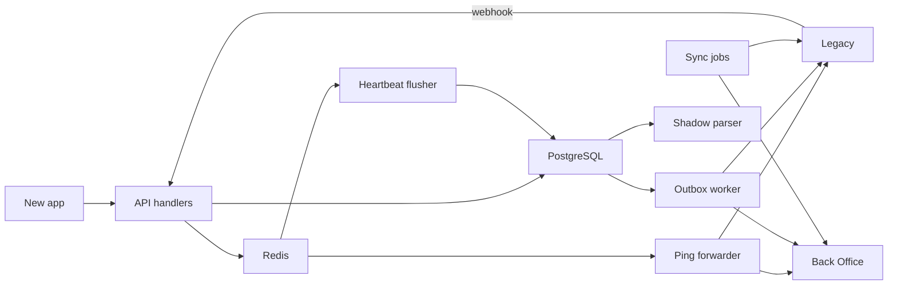

# 02 · System

| | |
|---|---|
| **For** | Someone who needs processes and data before writing code |
| **Answers** | What runs in this service, what it stores, and what it is configured with |
| **Overview** | `00-index.md` |

```mermaid
flowchart LR
    APP["New app"] --> API["API handlers"]
    API --> PG["PostgreSQL"]
    API --> REDIS["Redis"]
    REDIS --> FLUSH["Heartbeat flusher"] --> PG
    REDIS --> PFWD["Ping forwarder"]
    PG --> OBX["Outbox worker"]
    PG --> SHADOW["Shadow parser"]
    PFWD --> LEG["Legacy"]
    PFWD --> BO["Back Office"]
    OBX --> LEG
    OBX --> BO
    JOBS["Sync jobs"] --> LEG
    JOBS --> BO
    LEG -->|"webhook"| API
```

## Processes

One Go binary per environment. It runs the handlers and the background loops. Handlers scale horizontally. Every loop is safe to run on more than one instance: it either claims rows with `FOR UPDATE SKIP LOCKED` or takes a Redis lock.

| Piece | Job | Detail |
|---|---|---|
| API handlers | App routes and the legacy webhook | `04`–`09`, `10` |
| Heartbeat flusher | Copies dirty heartbeats from Redis to PostgreSQL in batches | `04-device-ping.md` |
| Ping forwarder | Sends the latest heartbeat per device to legacy or the Back Office | `04-device-ping.md` |
| Outbox worker | Delivers SMS, notifications, sign-outs and resets | `10-legacy-bridge.md` |
| Shadow parser | Parses stored SMS into statements. Nothing reads them during coexistence except the parity report | `07-sms-noti-ingest.md` |
| Sync jobs | Sender masks and templates, user reconcile, device reconcile, version poll | `07`, `10`, `08` |

## What is stored

| Place | What |
|---|---|
| PostgreSQL `sim_device` | One row per normalised SIM: binding, both secrets, latest heartbeat. `06-sim.md` |
| PostgreSQL `leader_device` | One row per (username, master code, device id). `04-device-ping.md` |
| PostgreSQL `refresh_token` | Hashes only. `05-user-login.md` |
| PostgreSQL `sms_inbox`, `sms_statement`, `noti_inbox` | Everything received, and shadow statements. `07-sms-noti-ingest.md` |
| PostgreSQL `outbox`, `legacy_event`, `audit_log` | Delivery queue, webhook idempotency, resets. `10-legacy-bridge.md` |
| Redis | Latest heartbeat per device, dirty set, forwarder pending set, token revocation, sender-mask cache, version cache |

Redis holds only data that can be rebuilt or that a newer ping replaces. Anything that must survive a restart lives in PostgreSQL.

`LastPingTime` is when this service accepted the ping, in UTC. A SIM counts as **connected** when it is logged in and `LastPingTime` is within the disconnect threshold (default 10 minutes). That is computed when asked. It is not stored. During coexistence nothing outside this service reads it. The Back Office reads legacy.

## Configuration, per environment

From the secret manager, never from the repository. No value is shared between Internal and Reseller.

| Group | Keys |
|---|---|
| Hosts | legacy base URL, Back Office base URL, Back Office notification host, object-storage bucket and APK prefix |
| Stores | PostgreSQL URL, Redis URL |
| Switches | `pingLegacyRoute`, `shouldFwdSmsToLegacy`, `switchOverlapSeconds`, disconnect threshold, verify-sender |
| Secrets | token signing key, legacy-secret encryption key, legacy webhook secret, legacy user-admin shared secret, app-version secret, notification secret, Telegram bot token |
| App config | the values served by `09-app-remote-config.md` |

Switches and app config change without a new binary. They are reloaded every 30 seconds.

## Not done here during coexistence

Back Office account ping, OTP hook, Telegram SMS alerts, push, deposit confirmation, and BO page APIs. Legacy does all of them for new-app phones, because it receives their traffic through passthrough.
