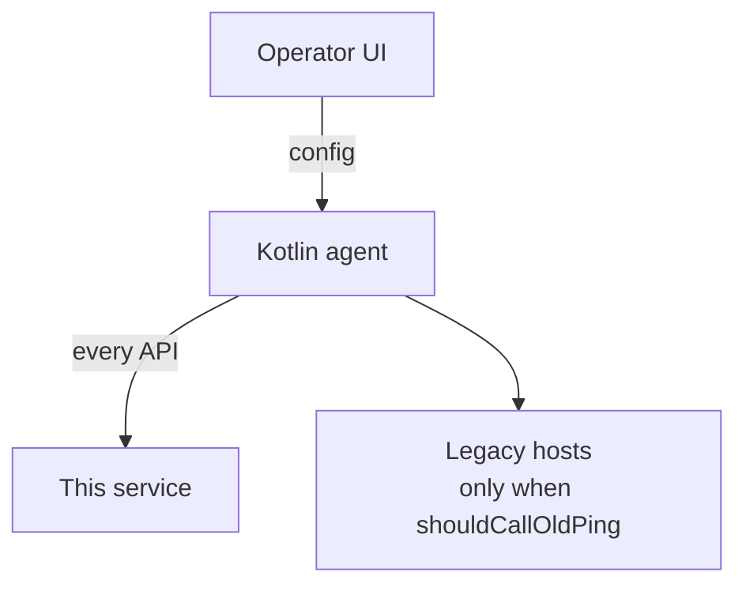

# 03 · Mobile

**For:** the person changing the Android agent.
**This file answers:** what the phone is responsible for, at the level of calls and headers.
**Ping request, signature, and timing:** `04-device-ping.md`.

The operator UI stays the current app. Capture and the heartbeat loop stay in the Kotlin process, which keeps running after the UI is killed and restores itself after reboot. This plan does not replace the UI.

The phone uses one base URL for this service.

## Headers on every API

Every request the phone sends to this service carries these headers. The server reads identity from the headers. Do not repeat them in the JSON body.

| Header | Required | Value |
|---|---|---|
| `X-Device-Id` | yes | Stable id of this phone. |
| `X-Device-Name` | no | Name an operator would recognise. Empty leaves the stored name unchanged. |
| `X-Build-Number` | no | Build of this install, as a string. Empty leaves the stored build unchanged. |

## Calls

| Call | Where | Detail |
|---|---|---|
| Device ping, leader ping, notification ping | This service | `04-device-ping.md` |
| The matching legacy ping | Legacy host, only when `shouldCallOldPing` is on | `04-device-ping.md` |
| Version check | Separate from ping | Not written |
| Login | This service | `05-user-login.md` |
| SIM, SMS and notification upload | This service, later | Not written |

`shouldCallOldPing` on the phone and `shouldFwdFromServer` on the server are the same switch. Turn on one side only. What the server does with it is `04-device-ping.md`.
