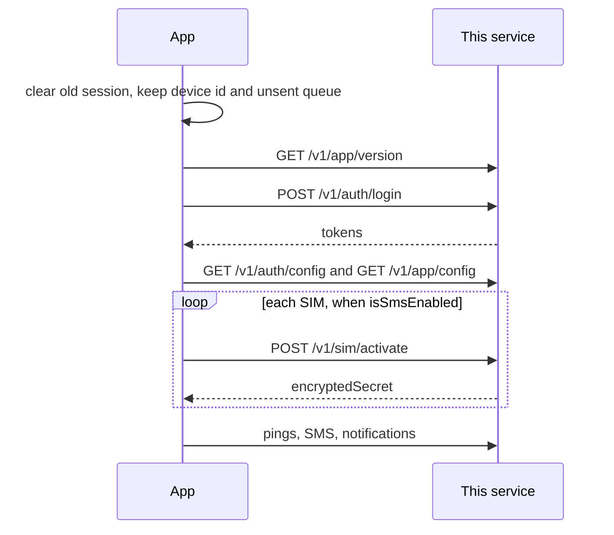

# 03 · Mobile

| | |
|---|---|
| **For** | The person building the new Android app |
| **Answers** | What the new app does from first launch onwards, and the rules for every call |
| **Server detail** | `04`–`09` |

The operator UI is rebuilt against the new API. Capture and the heartbeat loop stay in the Kotlin process, which keeps running after the UI is killed and restores itself after reboot.

## Upgrade requirements

The new app replaces the old one in place. All three are required.

| Requirement | Why |
|---|---|
| Same application id and signing key as the old app | Android installs it as an update, and the old app's `IsForceUpdate` prompt can deliver it |
| **Same device id as the old app** | Legacy binds each SIM to the old device id. A different id makes legacy answer `2002` on activation, and every upgraded phone fails at once. Read the id the old app stored. Derive it the same way only when nothing is stored. |
| The old app's unsent SMS and notification queue is drained through the new routes | Items the old app captured but never delivered would otherwise be lost. Duplicates are safe: both targets deduplicate. |

## First launch of the new build

```mermaid
sequenceDiagram
    participant App
    participant JMS as This service

    App->>App: clear old session, keep device id and unsent queue
    App->>JMS: GET /v1/app/version
    App->>JMS: POST /v1/auth/login
    JMS-->>App: tokens
    App->>JMS: GET /v1/auth/config and GET /v1/app/config
    loop each SIM, when isSmsEnabled
        App->>JMS: POST /v1/sim/activate
        JMS-->>App: encryptedSecret
    end
    App->>JMS: pings, SMS, notifications
```

1. Clear the stored session: user, flags, and old secrets. Keep the device id and the unsent queue. Call nothing on legacy.
2. Check the version (`08`). If an update is forced, stop here.
3. Log in (`05`).
4. Read the user flags (`05`) and the app config (`09`).
5. When `isSmsEnabled` is on, activate every SIM that will collect (`06`). A failed activation is shown to the operator with its code.
6. Start the loops the flags allow:

| Loop | Runs when | Route |
|---|---|---|
| Device ping, every 60 s | `isPingEnabled`, not a leader, and at least one SIM is activated | `04` |
| Leader ping, every 60 s | the user is a leader | `04` |
| Notification ping, every 60 s | `isNotiPingEnabled` | `04` |
| SMS upload | `isSmsEnabled` and the SIM is activated | `07` |
| Bank-notification upload | `isNotiEnabled` | `07` |

7. Drain the old app's queue through the same upload routes.

This same sequence runs after any later logout.

## Every request

| Header | Required | Value |
|---|---|---|
| `X-Device-Id` | yes | The stable device id described above |
| `X-Device-Name` | no | Name an operator would recognise. Empty leaves the stored name unchanged |
| `X-Build-Number` | yes | This build's version code, as a decimal string |
| `Authorization` | yes, except login, refresh, and version | `Bearer <accessToken>` |

The server reads identity from headers and from the token. Do not repeat them in the JSON body.

Success is HTTP 200. Failure is JSON `{ "message", "code" }`. The app acts on `code` only:

| HTTP | `code` | App action |
|---|---|---|
| 401 | `INVALID_ACCESS_TOKEN` | Refresh once and retry. If refresh fails, go to login |
| 401 | `INVALID_REFRESH_TOKEN` | Go to login |
| 400 | `DEVICE_MISMATCH` | Go to login |
| 400 | `DEVICE_NOT_ACTIVATED` | Activate the SIM again |
| 400 | `INVALID_SIGNATURE` | Activate that SIM again. The secret is lost or was replaced |
| 400 | `SIM_BOUND_TO_OTHER_DEVICE` | Show it. An operator must reset the SIM |
| 503 | `LEGACY_UNAVAILABLE`, `BO_UNAVAILABLE` | Retry with backoff. Keep queued items |
| 500 | `STORAGE_FAILED` | Retry with backoff. Keep queued items |
| 400 | anything else | Log it and drop that item. Do not retry |

## Tokens

- Read expiry from the token itself (`05`).
- Refresh when less than one hour is left, so the ping loop never meets an expired token.
- Only one refresh can be in flight at a time. A refresh rotates the refresh token, so two parallel refreshes would log the user out.

## Leaving

| Operator action | Calls |
|---|---|
| Log out | `POST /v1/sim/sign-out`, then `POST /v1/auth/logout` |
| Move a SIM to another phone | `POST /v1/sim/reset` for that SIM |

Details are in `06-sim.md` and `05-user-login.md`.

## Legacy ping from the phone

Only while `09` delivers a non-empty `legacyPingBaseUrl`:

- when `shouldCallOldPing` is on, send the legacy ping after every new ping;
- when new pings have failed for `legacyFallbackAfterSeconds` with no HTTP response or a 5xx, send the legacy ping on every tick until a new ping succeeds.

The legacy bodies are in `04-device-ping.md`. This is the only legacy call the new app makes.
