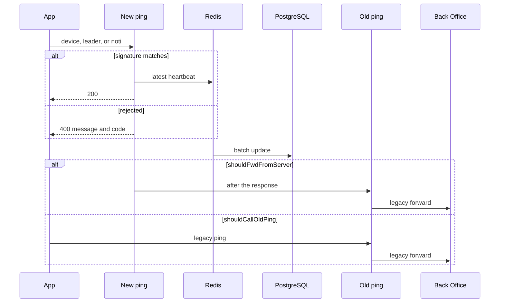

# 04 · Device ping

**For:** the person implementing the Go ping handlers.
**This file answers:** what the server does after a ping arrives.
**Headers on every API:** `03-mobile.md`.



Build this before login, SIM, and ingest. There is no version check on any route in this file.

The behaviour that still has to happen, from the live heartbeat:

- The FCM token on the device row stays current, because push uses it.
- `LastPingTime` is the server's UTC time, and connectivity is computed from it.
- The client IP is recorded, classified, and alerted for the tenants configured for that.
- The Back Office account ping still happens, once per logged-in SIM, but only on the old path.
- A new ping does not create a device row.
- The response carries no command. Success is HTTP 200. Failure is HTTP 400 with a message and a code.

The version gate that used to sit on ping does not. A new ping does not report an old build.

## Response

Success is HTTP 200 and an empty body. The client treats any 200 as accepted. It does not read a success code.

Failure is HTTP 400:

```json
{ "message": "X-Device-Id is required", "code": "MISSING_DEVICE_ID" }
```

| `code` | When |
|---|---|
| `MISSING_DEVICE_ID` | `X-Device-Id` is missing or blank |
| `INVALID_SIGNATURE` | `signature` is missing, or it matches no secret stored for that device id |
| `MISSING_FIELD` | A required JSON field for that route is missing |

Nothing is written on 400.

## New pings

Device, leader, and notification use this same handler. `X-Device-Id`, `X-Device-Name`, and `X-Build-Number` are the headers from `03-mobile.md`. The body is:

| Field | Required | Meaning |
|---|---|---|
| `signature` | yes | Uppercase hex SHA256 of `X-Device-Id + fcmToken + deviceSecret`, no separators. `fcmToken` is `""` when omitted. |
| `fcmToken` | no | Non-empty replaces the stored push token. Empty or omitted leaves it. |

`deviceSecret` is the secret already stored for that `X-Device-Id`. Ping does not issue secrets. If several rows share the device id, one matching secret is enough. No matching secret, including no row at all, is `INVALID_SIGNATURE`.

| Route | Extra required fields | Redis key |
|---|---|---|
| `POST /v1/devices/ping` | none | device id |
| `POST /v1/leaders/ping` | `username`, `masterCode` | username, master code, device id |
| `POST /v1/noti-devices/ping` | none | device id, separate from the collector key |

A matching signature writes Redis, then returns 200. The leader flush may insert the first row on (`username`, `masterCode`, `deviceId`). It does not check that the user exists. The leader flush may insert the first row on (`username`, `masterCode`, `deviceId`). It does not check that the user exists. The leader flush may insert the first row on (`username`, `masterCode`, `deviceId`). It does not check that the user exists.

### Redis, then a batch to the database

The request does not update PostgreSQL. It writes one Redis value for the key in the table above, replacing any value already under that key. A collector ping and a notification ping for the same device id do not share a key.

- `LastPingTime`: server UTC now
- `fcmToken`: only when the body sent a non-empty token
- `deviceName`: from `X-Device-Name`, only when the header is non-empty
- `buildNumber`: from `X-Build-Number`, only when the header is non-empty
- `clientIp` and its class: direct, CDN, or proxy. The address is the first configured forwarding header, otherwise the connection peer

A newer ping for the same device replaces the key, so the buffer stays one entry per device. An empty `fcmToken` must not wipe the token already in Redis.

A class change for a master merchant code listed in config is sent to that tenant's Telegram channel after the Redis write. Telegram failure does not change the HTTP result.

The worker copies dirty keys into PostgreSQL:

| Rule | Value |
|---|---|
| Flush | 200 dirty devices, or 45 seconds, whichever comes first |
| Write | One batch update. Every row with that device id is updated, including a logged-out row |
| Success | Clear those dirty keys |
| Database error | Leave the keys dirty and try the batch again. Do not drop them |

HTTP 200 means Redis accepted the heartbeat. It does not mean PostgreSQL has the row yet, and it does not mean the legacy host was called.

After the response is sent, if `shouldFwdFromServer` is true, invoke the old handler that matches this route. The phone is not waiting. That call uses the heartbeat just written to Redis, including `LastPingTime`.

## Old collector ping

`POST /device/ping` is the collector handler that calls the Back Office.

The phone calls it when `shouldCallOldPing` is true. This service calls it when `shouldFwdFromServer` is true. The body is the legacy body, not the new one: `DeviceId`, `UIVersion`, `AppVersion`, `FCMToken`, `DeviceName`. It is not signed. A bad body is HTTP 400 `{ "message", "code": "MISSING_FIELD" }` and does not call the Back Office. A legacy success stays HTTP 200 and the JSON string `"0000"`, because existing callers already parse that string.

For each logged-in row with this device id, enqueue:

```json
{
  "PhoneNumber": "",
  "MerchantCode": "master merchant code on the row",
  "LastPingTime": "UTC from the latest heartbeat",
  "UIVersion": "from the legacy body when it sent 1 or 2, otherwise the value already stored"
}
```

Post it to `POST {BO}/api/account/ping`.

One unsent payload per row. A newer heartbeat replaces it. Flush every 15 seconds, or at 200 waiting payloads. Timeout 5 seconds. At most 32 calls at once. Success deletes the payload. Failure keeps it. Alert when the oldest has waited more than 2 minutes. A restart does not drop the outbox.

A logged-out row is not enqueued. One device id with two SIMs produces two calls. An unknown device id returns HTTP 200 and `"0000"`, and enqueues nothing.

A legacy client that never calls the new ping still has to move `LastPingTime` and the FCM token. For that client only, this handler writes those fields straight to PostgreSQL, then enqueues. It does not go through Redis.

## Connectivity

A row is connected when it is logged in and `LastPingTime` in PostgreSQL is inside the disconnect threshold. The threshold is configuration, default 10 minutes. There is no stored connected flag and no job that clears one.

Until the batch worker has flushed, a ping that is only in Redis is not visible to that check. The flush interval is the lag.

## Old leader ping

`POST /leader-account/ping` sends `Username`, `MasterCode`, `DeviceId`, `IP`, `LastPingTime`, and `DeviceName` to `POST {BO}/api/leader-account/ping-event`, with the same outbox rules as the account ping. The phone calls this when `shouldCallOldPing` is true. This service calls it after the new leader ping when `shouldFwdFromServer` is true.

Success for a legacy caller is HTTP 200 and `"0000"`. A bad body is HTTP 400 `{ "message", "code": "MISSING_FIELD" }`. A legacy client that never calls the new route gets the upsert and the Back Office call together, without Redis.

## Old notification ping

`POST /noti-device/ping` is the onward call. It posts the legacy body to the notification host:

```json
{
  "DeviceId": "",
  "MasterMerchantCode": "",
  "NotificationNumber": "",
  "DeviceName": "omit when empty",
  "AppVersion": 0,
  "Timestamp": 0,
  "Signature": "uppercase hex SHA256(DeviceId + MasterMerchantCode + notificationSecret)"
}
```

`Timestamp` is epoch seconds. The phone sends this body itself when `shouldCallOldPing` is true. When `shouldFwdFromServer` is true, this service builds that body from the notification number and master merchant code stored for the device, signs it with the notification secret, and posts it. If either stored value is missing, it does not post, and the skip is logged. The same outbox rules apply. A failure of this call does not affect the collector ping.

Legacy success is HTTP 200 and `"0000"`. A bad body is HTTP 400 `{ "message", "code": "MISSING_FIELD" }`.

## After sign-out

Sign-out itself is not written yet. Once a row is logged out, the old path skips it. Once the device id is cleared, both device routes treat it as unknown. Sign-out also clears leader push tokens bound to that device. That clear is part of sign-out, not part of this request.

## Done when

- A signed new device, leader, or notification ping writes Redis and returns HTTP 200, with no legacy forward.
- A missing device id returns HTTP 400 `MISSING_DEVICE_ID`. A bad signature, including an unknown device id, returns HTTP 400 `INVALID_SIGNATURE`. Neither writes Redis.
- Within 45 seconds, or by 200 dirty devices, PostgreSQL has the new `LastPingTime` and, when sent, the new FCM token.
- A failed database batch leaves the Redis keys in place.
- Flag off: nothing is forwarded.
- Only `shouldFwdFromServer`: this service alone performs the old device, leader, and notification calls.
- Only `shouldCallOldPing`: the phone performs those old calls, and this service does not add them.
- A new ping does not return a bare `"0000"` or `"1008"`.
