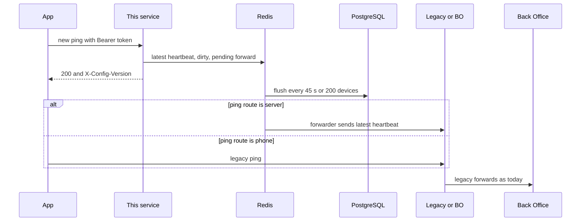

# 04 · Device ping

| | |
|---|---|
| **For** | The person implementing the ping handlers, flusher, and forwarder |
| **Answers** | What happens after a ping arrives, and how the Back Office still learns the phone is alive |
| **Headers, auth** | `03-mobile.md`, `05-user-login.md` |
| **Needs** | A token (`05`) and, for a device ping, an activated SIM (`06`) |


```mermaid
sequenceDiagram
    participant App
    participant New as This service
    participant Redis
    participant DB as PostgreSQL
    participant Leg as Legacy or BO
    participant BO as Back Office

    App->>New: new ping with Bearer token
    New->>Redis: latest heartbeat, dirty, pending forward
    New-->>App: 200 and X-Config-Version
    Redis->>DB: flush every 45 s or 200 devices
    alt ping route is server
        Redis->>Leg: forwarder sends latest heartbeat
    else ping route is phone
        App->>Leg: legacy ping
    end
    Leg->>BO: legacy forwards as today
```

The Back Office decides whether a collecting account can take deposits from the pings legacy forwards. During coexistence this service never calls `/api/account/ping` itself. It makes sure legacy receives a ping for every new-app phone, and legacy does the rest.

There is no version check on any route in this file.

## Routes

| Route | Caller | Body |
|---|---|---|
| `POST /v1/devices/ping` | collector (`userType` master) | `{ "fcmToken"? }` |
| `POST /v1/leaders/ping` | leader (`userType` leader) | `{ "fcmToken"? }` |
| `POST /v1/noti-devices/ping` | any user with `isNotiPingEnabled` | `{ "notificationNumber", "fcmToken"? }` |

Every route requires the Bearer token. Identity comes from the token: `username`, `merchantCode`, `systemType`, `userType`, and the bound device id `did`.

Checks, in order. Nothing is written on failure.

| Check | Failure |
|---|---|
| Token valid and not revoked | 401 `INVALID_ACCESS_TOKEN` |
| `X-Device-Id` present | 400 `MISSING_DEVICE_ID` |
| `X-Device-Id` equals `did` | 400 `DEVICE_MISMATCH` |
| Route matches `userType` | 400 `WRONG_USER_TYPE` |
| Device ping: at least one logged-in `sim_device` row with this device id and `MerchantCode` equal to the token's | 400 `DEVICE_NOT_ACTIVATED` |
| Notification ping: `notificationNumber` present | 400 `MISSING_FIELD` |

Success is HTTP 200, an empty body, and header `X-Config-Version` (`09`). A 200 means Redis accepted the heartbeat. It does not mean PostgreSQL has it, and it does not mean legacy was called.

## Heartbeat in Redis

Write one value per key, replacing any older value:

| Route | Key |
|---|---|
| device | `hb:dev:{deviceId}` |
| leader | `hb:lead:{username}:{masterCode}:{deviceId}` |
| notification | `hb:noti:{deviceId}` |

| Field | Value |
|---|---|
| `lastPingTime` | Server UTC now |
| `fcmToken` | Only when the body sent a non-empty value. Empty never wipes the stored one |
| `deviceName` | From `X-Device-Name`, only when non-empty |
| `buildNumber` | From `X-Build-Number` |
| `clientIp`, `ipClass` | First configured forwarding header, otherwise the connection peer. Class is `direct`, `cdn`, or `proxy` |
| `notificationNumber` | Notification route only |

Add the key to the dirty set, and to the forwarder pending set when the ping route is `server`.

## Flush to PostgreSQL

| Rule | Value |
|---|---|
| Trigger | 200 dirty keys, or 45 seconds, whichever comes first |
| Device key | One batch update of every `sim_device` row with that device id |
| Leader key | Upsert `leader_device` on (username, master code, device id). A leader's first ping creates the row. The token proves the user exists |
| Notification key | Upsert `noti_device` on device id |
| Success | Remove the keys from the dirty set, unless a newer ping arrived during the flush |
| Database error | Keep the keys dirty and retry. Never drop them |

## Forward to legacy (ping route `server`)

The forwarder sends the **latest** heartbeat per key. A newer ping replaces an unsent one, so the queue never holds more than one entry per device.

| Rule | Value |
|---|---|
| Trigger | Every 15 seconds, or at 200 pending keys |
| Concurrency | At most 32 calls at once, 5-second timeout |
| Success | Remove from pending, unless a newer ping arrived |
| Failure | Keep pending. The next tick retries with the latest heartbeat |
| Alert | Any key pending for more than 2 minutes. The Back Office drops an account after 10 |

Payloads. Values not listed come from the heartbeat.

**Device** → legacy `POST /api/Device/ping`

```json
{ "DeviceId": "X-Device-Id", "UIVersion": 2, "AppVersion": 0,
  "FCMToken": "latest stored token", "DeviceName": "latest stored name" }
```

`AppVersion` is `0` on purpose. Legacy never version-gates a ping that reports `0`, so passthrough can never be blocked by the legacy gate. Legacy looks up its own rows for this device id and notifies the Back Office once per logged-in SIM. This works because every activation also happens on legacy (`06`).

**Leader** → legacy `POST /api/leader-account/ping`

```json
{ "Username": "token", "MasterCode": "token merchantCode", "DeviceId": "X-Device-Id",
  "UIVersion": 2, "AppVersion": 0, "SystemType": "token", "FCMToken": "", "DeviceName": "" }
```

**Notification** → Back Office notification ping. **Confirm** the path with the Back Office team. Today's app posts it to the notification host.

```json
{ "DeviceId": "", "MasterMerchantCode": "token merchantCode", "NotificationNumber": "",
  "DeviceName": "omit when empty", "AppVersion": 0, "Timestamp": 0,
  "Signature": "uppercase hex SHA256(DeviceId + MasterMerchantCode + notificationSecret)" }
```

`Timestamp` is epoch seconds at send time.

**Client IP.** Send the heartbeat's `clientIp` in the header legacy reads for the caller address (**Confirm** the header name). Legacy then keeps its per-tenant IP alerts accurate. This service records the IP and class, but sends no Telegram IP alert during coexistence, because that would duplicate legacy's.

## Switching the ping route

Changing `pingLegacyRoute` must never leave a gap. A short overlap is harmless, because the Back Office only keeps the latest ping time.

| Change | This service | Phones |
|---|---|---|
| `phone` → `server` | Starts forwarding immediately | Stop on their next config fetch |
| `server` → `phone` | Keeps forwarding for `switchOverlapSeconds` (default 300), then stops | Start on their next config fetch |

Phones refetch config within one ping interval, because the ping response carries `X-Config-Version`.

## Legacy ping bodies the phone sends

Used when `shouldCallOldPing` is on, and during the fallback in `03-mobile.md`. They are the same three bodies as above, with two differences:

- the phone sends its real build number as `AppVersion`;
- the phone builds the notification-ping signature itself, as today's app does.

## Connectivity

A SIM is connected when it is logged in and `LastPingTime` in PostgreSQL is within the disconnect threshold (default 10 minutes). A ping that is still only in Redis is not yet visible. The flush interval is the lag.

## Done when

- A valid new ping of each kind writes Redis and returns 200 with `X-Config-Version`.
- A missing, expired, or revoked token returns 401. A device id that differs from the token returns `DEVICE_MISMATCH`. A device ping with no activated SIM returns `DEVICE_NOT_ACTIVATED`. None of them writes anything.
- PostgreSQL has the new `LastPingTime` within 45 seconds, and the new FCM token when one was sent. A failed batch keeps its keys.
- With route `server`, legacy receives a ping for every pinging device within 30 seconds. A legacy outage alerts after 2 minutes and recovers without manual action.
- With route `phone`, this service forwards nothing.
- Both switch directions overlap and never gap.
- Legacy's device page shows a new-app phone as connected, and a Back Office push reaches it.
