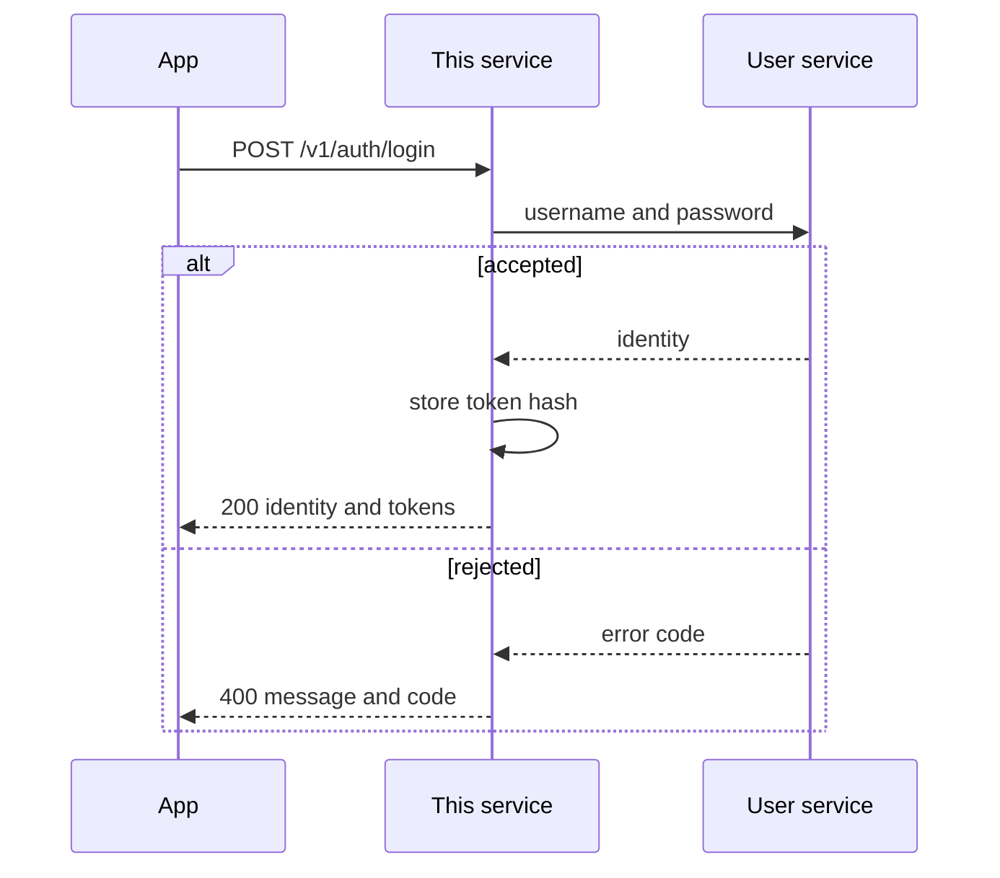

# 05 · User login

**For:** the person implementing login on this service, and the person wiring it in the app.
**This file answers:** how a username and password become a token, without this service becoming the user store.
**Headers on every API:** `03-mobile.md`. Ping does not send this token.
**Feature flags:** `POST /v1/auth/config`, not the login body.



This service does not create users, change passwords, or store a profile. It forwards the login and issues its own token.

## Login

`POST /v1/auth/login`

Headers are the set in `03-mobile.md`. The body is:

| Field | Required |
|---|---|
| `username` | yes |
| `password` | yes |

The password is forwarded as the user service expects it. This service does not hash it and does not write it down.

The user service is called in order, and the first failure is the response:

| User service result | HTTP | `code` |
|---|---|---|
| No such user | 400 | `INVALID_USERNAME` |
| Password does not match | 400 | `INVALID_PASSWORD` |
| User is not active | 400 | `INVALID_USER_STATUS_DISABLE` |
| User service cannot be reached | 503 | `USER_SERVICE_UNAVAILABLE` |

The body on 400 and 503 is `{ "message", "code" }`. A 503 must not be reported as a bad password. Nothing is stored on failure.

Success is HTTP 200. The body is identity and tokens. It does not include feature flags, and it does not include `expiresAt`.

```json
{
  "username": "",
  "merchantCode": "",
  "systemCode": "",
  "systemType": 0,
  "userType": 0,
  "accessToken": "",
  "refreshToken": ""
}
```

## Token

Each token is signed and carries its own expiry. The app reads that expiry from the token. Login and refresh do not repeat it in a field.

The server stores only the SHA-256 hash, the username, the merchant code, and a revoked flag. It does not store a copy of the profile.

| Rule | Value |
|---|---|
| Access lifetime | Configuration, default 24 hours, written into the token |
| Refresh lifetime | Configuration, default 30 days, written into the token |
| Where the app sends it | `Authorization: Bearer` on later calls to this service |
| Ping, leader ping, notification ping | Do not send it |

`POST /v1/auth/refresh` takes `{ "refreshToken" }` and returns a new access token and a new refresh token. The presented refresh token is revoked. A revoked, unknown, or expired refresh token is HTTP 400 `{ "code": "INVALID_REFRESH_TOKEN" }`.

`POST /v1/auth/logout` revokes the access token and its refresh token. Success is HTTP 200 and an empty body.

This service does not hear about a password change or a disabled user until the next login. Tokens stay valid until the expiry inside them, or until the app calls logout.

## Flags

`POST /v1/auth/config` is the flags API. It requires the access token. The body is `{ "username", "merchantCode", "systemType" }`. The call is forwarded to the user service.

Success is HTTP 200 and only the flags:

```json
{
  "isUseLandingPage": false,
  "isSmsEnabled": false,
  "isNotiEnabled": false,
  "isPingEnabled": false,
  "isNotiPingEnabled": false
}
```

They are the user service's values. This service does not recompute them.

A missing or expired access token is HTTP 400 `{ "code": "INVALID_ACCESS_TOKEN" }`. The app reads expiry from the token and logs in again when it has passed.

## Done when

- A good password returns 200 with identity and tokens, and no flags and no `expiresAt`.
- The app can read expiry from the access token.
- Flags come only from `POST /v1/auth/config`.
- `INVALID_USERNAME`, `INVALID_PASSWORD`, and `INVALID_USER_STATUS_DISABLE` stay distinct.
- The user service being down is `USER_SERVICE_UNAVAILABLE`, not a wrong password.
- The password is not in this database.
- Refresh rotates the refresh token. Logout makes both tokens unusable.
- Ping still succeeds with no `Authorization` header.
