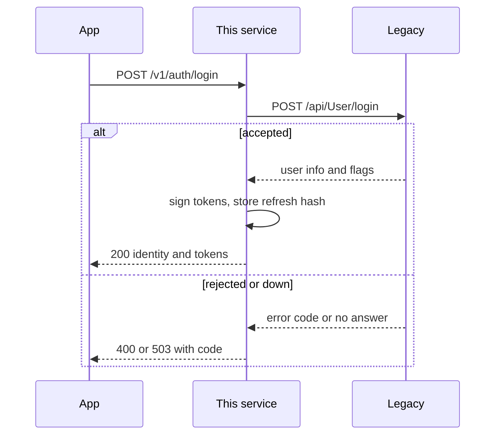

# 05 · User login

| | |
|---|---|
| **For** | Server implementer and app wiring |
| **Answers** | Username and password → tokens, with users still living in legacy |
| **Headers** | `03-mobile.md` |
| **Revocation sync** | `10-legacy-bridge.md` |


```mermaid
sequenceDiagram
    participant App
    participant JMS as This service
    participant Leg as Legacy

    App->>JMS: POST /v1/auth/login
    JMS->>Leg: POST /api/User/login
    alt accepted
        Leg-->>JMS: user info and flags
        JMS->>JMS: sign tokens, store refresh hash
        JMS-->>App: 200 identity and tokens
    else rejected or down
        Leg-->>JMS: error code or no answer
        JMS-->>App: 400 or 503 with code
    end
```

Users, passwords, and flags stay in legacy during coexistence. The Back Office and the Devsite keep managing them there. This service checks the password through legacy, then issues its own tokens. It never stores a password or a user profile.

## Login

`POST /v1/auth/login`. No token. `X-Device-Id` is required, because the token is bound to it.

| Field | Required |
|---|---|
| `username` | yes |
| `password` | yes |

Steps:

1. Rate limit: after 10 failures in 15 minutes for the same username, or for the same device id, return 429 `TOO_MANY_ATTEMPTS`.
2. Call legacy `POST /api/User/login` with `{ "Username", "Password" }`. Timeout 5 seconds. Forward the password exactly as received. Never log it.
3. Map legacy's answer:

| Legacy answer | HTTP | `code` |
|---|---|---|
| Success | 200 | — |
| `INVALID_USERNAME` | 400 | `INVALID_USERNAME` |
| `INVALID_PASSWORD` | 400 | `INVALID_PASSWORD` |
| `INVALID_USER_STATUS_DISABLE` | 400 | `INVALID_USER_STATUS_DISABLE` |
| Timeout, 5xx, or anything unrecognised | 503 | `LEGACY_UNAVAILABLE` |

A legacy outage must never be reported as a wrong password. Nothing is stored on failure.

4. On success, sign an access token and a refresh token, and store the refresh token's hash.

Success body. Flags are not included: the app reads them from `GET /v1/auth/config`.

```json
{
  "username": "",
  "merchantCode": "",
  "systemCode": "",
  "systemType": 0,
  "userType": 0,
  "accessToken": "",
  "refreshToken": ""
}
```

All values come from legacy's login response. **Confirm** that legacy's error body carries these three codes as strings.

## Tokens

Signed JWT, algorithm ES256, one key pair per environment.

| Claim | Value |
|---|---|
| `sub` | username. Usernames are unique within a deployment |
| `mid` | master merchant code |
| `sc`, `st` | system code, system type |
| `ut` | user type: 1 master, 2 leader |
| `did` | the `X-Device-Id` sent at login |
| `jti`, `iat`, `exp` | id, issued-at, expiry |
| `typ` | `access` or `refresh` |

| Rule | Value |
|---|---|
| Access lifetime | Configuration, default 24 hours |
| Refresh lifetime | Configuration, default 30 days |
| Stored | Refresh tokens only: `jti` hash, username, `did`, family id, expiry, revoked time. Never the token itself |
| Checked on every request | Signature, expiry, `typ`, the revoked-`jti` set in Redis, and `iat` against the user's `revokedBefore` in Redis |

`POST /v1/auth/refresh` takes `{ "refreshToken" }` and needs no Bearer token.

- It returns a new access token and a new refresh token with the same claims, and revokes the one presented.
- A refresh token that was already rotated and is presented again means it was stolen. Revoke its whole family.
- A revoked, unknown, or expired refresh token, or one issued before the user's `revokedBefore`, returns 401 `INVALID_REFRESH_TOKEN`.

`POST /v1/auth/logout` revokes the access token's `jti` and its refresh family. Success is 200 with an empty body.

## When the user changes in legacy

A password change, a disable, or a delete in legacy sets `revokedBefore = now` for that username. The next request fails with 401. The refresh then fails too, and the app goes to login, where legacy refuses a disabled user or an old password. This service learns about the change in two ways, both specified in `10-legacy-bridge.md`:

- a webhook from legacy, within seconds;
- an hourly reconcile, as a safety net.

## Flags

`GET /v1/auth/config`, Bearer token. No body: identity comes from the token.

Calls legacy `POST /api/User/get-user-config` with `{ "Username": sub, "MerchantCode": mid, "SystemType": st }`, and returns only the flags:

```json
{
  "isUseLandingPage": false,
  "isSmsEnabled": false,
  "isNotiEnabled": false,
  "isPingEnabled": false,
  "isNotiPingEnabled": false
}
```

They are legacy's effective flags, which already apply the leader override and the collector fallback. This service does not recompute them.

- Legacy down returns 503 `LEGACY_UNAVAILABLE`. The app keeps its cached flags.
- The app calls this after login, on start, and whenever it refetches `09` config.

## Done when

- A good password returns 200 with identity and tokens, and no flags.
- The three legacy rejections stay distinct. A legacy outage returns `LEGACY_UNAVAILABLE`.
- Neither the password nor the access token is in this database or in any log.
- Refresh rotates. Reusing a rotated refresh token kills its family. Logout makes both tokens unusable.
- After a user is disabled in legacy, the next ping returns 401 within 1 minute if the webhook is live, and within 1 hour if it is not.
- `GET /v1/auth/config` returns legacy's flags for the token's user, and cannot be pointed at another user.
