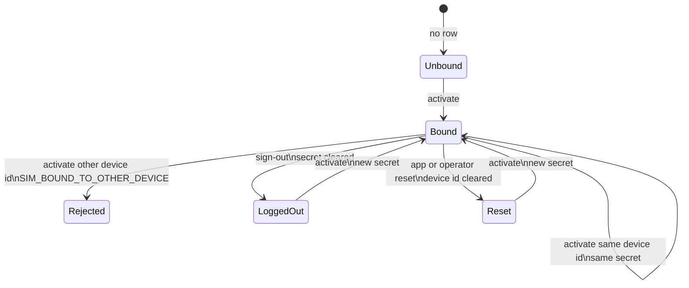

# 06 · SIM

| | |
|---|---|
| **For** | SIM bind, secret issue, sign-out, reset |
| **Answers** | How the phone gets a device secret and how binding is cleared |
| **Headers** | `03-mobile.md` |
| **Ping** | Reads the row this file creates; does **not** create one |
| **Signature** | `04-device-ping.md` uses the secret from here |



Build this after login. Ingest is not required to ship it. Until a row exists and is logged in, ping can return 200 but signed upload will fail with `INVALID_SIGNATURE`.

## Device row

One row per normalised SIM phone number. At most one non-empty `DeviceId` is bound to that SIM at a time.

| Field | Meaning |
|---|---|
| `PhoneNumber` | Normalised SIM |
| `DeviceId` | From `X-Device-Id`. Empty after sign-out or reset |
| `AppendString` | Opaque device secret. Empty after sign-out. Unchanged on app reset until the next activate overwrites it |
| `MerchantCode` | Master merchant code, upper case |
| `Status` | Logged in or logged out |
| `NotificationNumber` | SIM used for notification ping, when known |

The secret is created as `base64( SHA256( phone + "_" + deviceId + "_" + newGuid ) )`. It is stored and copied if the row moves. It is never rebuilt from the phone and device id alone.

## Activate

`POST /v1/sim/activate`

Requires the access token from `05-user-login.md`. Headers are the set in `03-mobile.md`. The body is:

| Field | Required |
|---|---|
| `phoneNumber` | yes, 10–15 characters as the app sends them |
| `publicKey` | yes, RSA public key, PEM or SPKI base64 |
| `masterMerchantCode` | yes when account verification is on |

`phoneNumber` in the body is the SIM. `X-Device-Id` is the phone.

Steps:

1. Normalise `phoneNumber` for storage and lookup.
2. Call the Back Office to verify that this SIM belongs to this merchant. Rejection is HTTP 400 `{ "code": "BO_ACCOUNT_REJECTED" }`. Outage is HTTP 503 `{ "code": "BO_UNAVAILABLE" }`.
3. If a row exists for this phone, status is logged in, and `DeviceId` is a different non-empty value than `X-Device-Id`, return HTTP 400 `{ "code": "SIM_BOUND_TO_OTHER_DEVICE" }`.
4. If a row exists for this phone, `DeviceId` matches `X-Device-Id`, and status is logged in, return HTTP 200 with the **same** secret encrypted with `publicKey`. Do not rotate the secret.
5. If there is no row, or `DeviceId` is empty, or status is logged out, set `DeviceId` to `X-Device-Id`, issue a **new** secret, set status to logged in, encrypt, return HTTP 200.

Success body:

```json
{ "encryptedSecret": "base64 RSA PKCS1 v1.5 ciphertext" }
```

| HTTP | `code` |
|---|---|
| 400 | `INVALID_PHONE`, `MISSING_FIELD`, `INVALID_PUBLIC_KEY`, `BO_ACCOUNT_REJECTED`, `SIM_BOUND_TO_OTHER_DEVICE` |
| 503 | `BO_UNAVAILABLE` |
| 500 | `ENCRYPTION_FAILED` |

Legacy alias: `POST /device/active` runs the same handler. Success for old clients may still return the encrypted secret as the raw body. New clients use the JSON field above.

## Sign-out

`POST /v1/sim/sign-out`

The operator leaves the session on this phone. Every SIM row that shares this `X-Device-Id` is affected.

Body: `phoneNumber`, `signature` as below. Success is HTTP 200 and an empty body. Idempotent.

```text
signature = uppercase hex SHA256( phoneNumber + X-Device-Id + deviceSecret )
```

On success for **all rows with this `DeviceId`**: clear `DeviceId`, clear secret, clear FCM token, set logged out, clear leader push tokens on this device, notify the Back Office for leader cleanup.

Legacy alias: `POST /device/sign-out`. Old success was HTTP 200 and `"0000"`.

## App reset

`POST /v1/sim/reset`

The operator clears the SIM binding on **this phone** so the SIM can be activated on another device, or this device can activate again. This is not the same as sign-out.

Body: same as sign-out (`phoneNumber`, `signature` with the same formula).

On success for the row matching this normalised phone and this `X-Device-Id`:

- Clear `DeviceId` and FCM token
- Set status to logged out
- **Do not** clear `AppendString` yet. The next activate replaces it with a new secret.

Uploads and ingest fail after reset until activate completes, because `DeviceId` is empty or the secret no longer matches what the app holds.

Legacy alias: `POST /device/reset`. That route was unsigned in production. The new route **requires** the signature. Old success was HTTP 200 and `"0000"`.

## Operator reset

These calls use the Back Office service credential, not the device secret. Each call writes an audit row: who, when, reason, and which phones or device id were affected.

### By phone number

`POST /v1/sim/reset-by-phone`

Body: `{ "phoneNumber", "masterMerchantCode", "reason" }`.

Normalise the phone. For **every** device row with that SIM, clear `DeviceId`, secret, and FCM token, and set logged out.

Legacy alias: `POST /device/reset2`.

### By device id

`POST /v1/sim/reset-by-device-id`

Body: `{ "deviceId", "reason" }` or query `deviceId` for the legacy shape.

For **every** row with that `DeviceId`, clear `DeviceId`, secret, and FCM token, and set logged out. Clear leader tokens on that device.

Legacy alias: `POST /device/reset-by-device-id`.

### From Telegram

`POST /v1/sim/telegram-reset`

Body: `{ "phoneNumber", "masterMerchantCode", "signature" }`.

```text
signature = uppercase hex SHA256( phoneNumber + masterMerchantCode + telegramResetSecret )
```

Use `phoneNumber` as sent. Same row updates as reset-by-phone. Write the audit row with actor `telegram`.

Legacy alias: `POST /device/telegram-reset-device`.

## Sign-out vs reset

| | Sign-out | App reset | Operator reset |
|---|---|---|---|
| Caller | App, signed | App, signed | Back Office or Telegram |
| Scope | All SIMs on this `DeviceId` | One SIM on this `DeviceId` | One phone or one device id |
| Clears secret | yes | no, until next activate | yes |
| Use when | Operator logs out | Move SIM to another phone | Support clears a stuck SIM |

## Signatures after SIM

Every signed call that uses the device secret must hash the same string the app signed. For ping that is `X-Device-Id + fcmToken + deviceSecret`. For SMS ingest, the string is named in `07-sms-noti-ingest.md`. When a body carries `phoneNumber`, that value is as sent. Lookup uses the normalised phone.

## Done when

- Activate, sign-out, app reset, and operator reset behave as in the state diagram.
- `SIM_BOUND_TO_OTHER_DEVICE` clears after operator reset-by-phone or app reset on the bound device.
- Sign-out clears the secret. App reset does not, and the following activate returns a new secret.
- Legacy aliases behave like their `v1` handler, with legacy success shapes where old clients still call them.
- Telegram and operator resets are audited.
