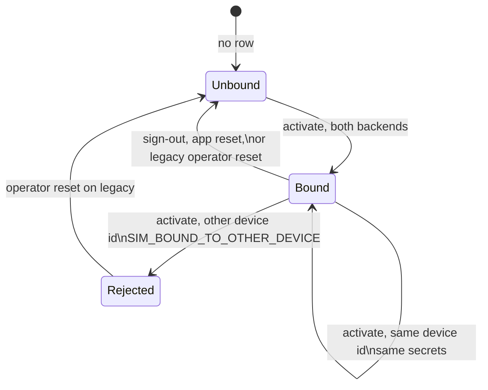

# 06 · SIM

| | |
|---|---|
| **For** | SIM activation, sign-out, and reset, on this service and on legacy |
| **Answers** | How a SIM is bound to a phone on both backends, and how that binding is cleared |
| **Headers, auth** | `03-mobile.md`, `05-user-login.md` |
| **Used by** | Device ping (`04`) needs an activated row. SMS ingest (`07`) needs both secrets |

```mermaid
stateDiagram-v2
    [*] --> Unbound: no row
    Unbound --> Bound: activate, both backends
    Bound --> Bound: activate, same device id\nsame secrets
    Bound --> Rejected: activate, other device id\nSIM_BOUND_TO_OTHER_DEVICE
    Bound --> Unbound: sign-out, app reset,\nor legacy operator reset
    Rejected --> Unbound: operator reset on legacy
```

Every activation happens on **both** backends: first legacy, then here. That gives three things:

- legacy enforces one SIM per device across old-app and new-app phones;
- legacy pings, pushes, and BO pages cover new-app phones;
- this service holds the legacy secret it needs to forward SMS (`07`).

## Device row

Table `sim_device`, one row per normalised SIM phone number.

| Field | Meaning |
|---|---|
| `PhoneNumber` | Normalised SIM. Unique |
| `PhoneNumberAsSent` | `phoneNumber` exactly as the app sent it at activation. Used to sign legacy calls |
| `DeviceId` | From `X-Device-Id`. Empty when unbound |
| `Secret` | Device secret issued here. Opaque. Empty when unbound |
| `LegacySecret` | Secret legacy issued, encrypted at rest (AES-GCM, key from the secret manager). Empty when unbound |
| `MerchantCode` | Master merchant code from the token, upper case |
| `Status` | `logged_in` or `logged_out` |
| `FcmToken`, `DeviceName`, `BuildNumber`, `LastPingTime`, `ClientIp`, `IpClass` | Written by the heartbeat flusher (`04`) |
| `ActivatedAt`, `UpdatedAt` | UTC |

`Secret` is `base64( SHA256( phone + "_" + deviceId + "_" + newUuid ) )`. It is stored and never rebuilt.

### Phone normalisation

Used for storage and lookup only. Signed strings always use the value as sent.

1. Trim. Remove a leading `+`.
2. Map country prefixes to a local leading `0`: `880` (BD), `84` (VN), `66` (TH), `92` (PK), `95` (MM), `60` (MY). Apply this only when the number is long enough to carry the prefix (11–13 digits). For `977` (NP), remove the prefix.
3. The result must be 10–15 digits, digits only. Otherwise the request fails with `INVALID_PHONE`.

This must produce exactly what legacy produces. Test it against a sample of production legacy rows.

## Activate

`POST /v1/sim/activate`, Bearer token, collector only.

| Field | Required |
|---|---|
| `phoneNumber` | yes, 10–15 characters as the app reads it |
| `publicKey` | yes, RSA public key, PEM or SPKI base64 |

The master merchant code comes from the token.

Steps, in order:

1. Token checks as in `04` (`DEVICE_MISMATCH`, `WRONG_USER_TYPE`).
2. Validate `publicKey` and normalise `phoneNumber`.
3. If a logged-in row for this phone has a different non-empty `DeviceId`, return 400 `SIM_BOUND_TO_OTHER_DEVICE`. Call nothing.
4. Deliver synchronously any pending legacy sign-out or reset for this phone from the outbox (`10`). Otherwise legacy would process it after step 6 and undo the activation. If delivery fails, return 503 `LEGACY_UNAVAILABLE`.
5. Back Office verify: `POST {BO}/api/account/verify-bo-account` with `{ "PhoneNumber": normalised, "MerchantCode": mid }`. Timeout 5 seconds.
   - `IsSuccessful: false` → 400 `BO_ACCOUNT_REJECTED`, carrying the BO message.
   - Timeout, 5xx, or malformed answer → 503 `BO_UNAVAILABLE`.
   - **Confirm** whether legacy sends the normalised phone or the raw one here.
6. Legacy activate: `POST {LEGACY}/api/Device/active` with `{ "PhoneNumber": as sent, "DeviceId": X-Device-Id, "PublicKey": <ephemeral>, "MasterMerchantCode": mid }`. `<ephemeral>` is a fresh RSA-2048 key pair made for this call. Decrypt legacy's answer with its private key, then discard the pair.

| Legacy answer | Result |
|---|---|
| Encrypted secret | Continue |
| `2002` | 400 `SIM_BOUND_TO_OTHER_DEVICE`. The SIM is bound to another phone, possibly an old-app phone |
| `2004` | 400 `BO_ACCOUNT_REJECTED` |
| `1007` | 400 `INVALID_PHONE` |
| `1006` | 400 `MISSING_FIELD` |
| Anything else, timeout | 503 `LEGACY_UNAVAILABLE` |

7. Write the row in one transaction:
   - If the row is logged in with the same `DeviceId`, keep `Secret`.
   - Otherwise issue a new `Secret`.
   - Always store `LegacySecret` from step 6, and `PhoneNumberAsSent`, `MerchantCode`, and `Status = logged_in`.
8. Return `{ "encryptedSecret": base64 RSA PKCS#1 v1.5 of Secret with publicKey }`. Encryption failure → 500 `ENCRYPTION_FAILED`.

Retrying after any failure is safe. For the same device id, legacy returns the same legacy secret and this service keeps the same secret.

On an in-place upgrade, the phone sends the same device id the old app used (`03`). Legacy therefore returns its existing secret, and the old app's legacy session carries over.

## Sign-out

`POST /v1/sim/sign-out`, Bearer token, empty body. The operator leaves this phone. Every row with this `DeviceId` is affected. The call is idempotent, and success is 200 with an empty body.

In one transaction, for each row:

1. Add an outbox item `legacy.signout` for legacy `POST /api/Device/sign-out`. Build its payload now, while the legacy secret is still on the row: `{ "PhoneNumber": PhoneNumberAsSent, "DeviceId", "Signature": uppercase hex SHA256(PhoneNumberAsSent + DeviceId + LegacySecret) }`. **Confirm** the body and formula in legacy's code.
2. Clear `DeviceId`, `Secret`, `LegacySecret`, `FcmToken`, and set `logged_out`.

Also clear `fcmToken` on `leader_device` and `noti_device` rows with this device id. Legacy's sign-out already tells the Back Office to clean up leaders, so this service does not.

## App reset

`POST /v1/sim/reset`, Bearer token, body `{ "phoneNumber" }`. It clears one SIM on this phone, so the SIM can move to another phone.

For the row matching the normalised phone and this `DeviceId`, in one transaction:

1. Add an outbox item `legacy.reset` for legacy `POST /api/Device/reset` with `{ "PhoneNumber": PhoneNumberAsSent, "DeviceId" }`.
2. Clear `DeviceId`, `Secret`, `LegacySecret`, `FcmToken`, and set `logged_out`.

No matching row still returns 200.

## Operator reset

During coexistence, operators reset SIMs on legacy (Devsite, BO, Telegram) exactly as today. This service applies the same reset when legacy tells it through the webhook or the device reconcile in `10-legacy-bridge.md`:

- **by phone:** every row with that normalised phone;
- **by device id:** every row with that `DeviceId`.

Clear `DeviceId`, `Secret`, `LegacySecret`, `FcmToken`, and set `logged_out`. Write an `audit_log` row with actor, reason, source (`webhook` or `reconcile`), and the rows affected. Do not call legacy back.

An operator reset API on this service is **not written** (`00-index.md`).

## Summary

| | Sign-out | App reset | Operator reset |
|---|---|---|---|
| Caller | App | App | Legacy, via webhook or reconcile |
| Scope | All SIMs on this device | One SIM on this device | One phone, or one device id |
| Legacy told by | Outbox | Outbox | Legacy started it |
| Clears secrets | yes | yes | yes |

## Done when

- Activate binds the SIM on legacy and here. Legacy's device page shows it logged in with this device id.
- Re-activating the same phone and device returns the same secret, on both backends.
- A SIM bound to an old-app phone returns `SIM_BOUND_TO_OTHER_DEVICE`, and activates after an operator reset on legacy.
- A BO rejection and a BO outage return different codes.
- Sign-out and reset reach legacy even when legacy was down at the time of the call.
- Activating right after a sign-out never ends with legacy logged out.
- An operator reset on legacy clears the row here within 1 minute through the webhook, or 15 minutes through reconcile, and is audited.
