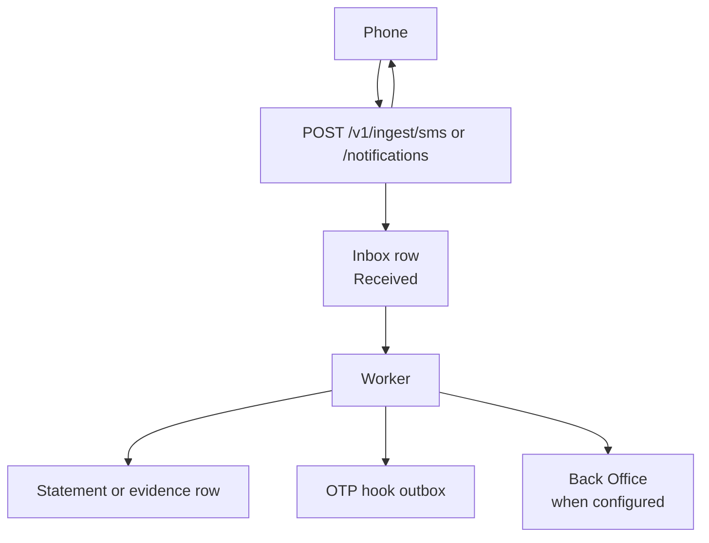

# 07 · SMS and notification ingest

| | |
|---|---|
| **For** | Ingest HTTP handlers and async workers |
| **Answers** | How one SMS or bank notification is accepted, stored, parsed |
| **Depends on** | `06-sim.md` (device state, secrets) |
| **Headers** | `03-mobile.md` |

> **Boundary:** Bank deposit matching stays on the Back Office. This service ingests, deduplicates, parses where it can, and keeps a durable record. It does **not** credit a player.



Build after `06-sim.md`. The HTTP response is sent **before** parsing finishes. The app does not learn whether a statement was created.

## Shared response shape

| Result | HTTP | Body |
|---|---|---|
| Accepted, including duplicate and ignored sender | 200 | empty |
| Validation or auth failure | 400 | `{ "message", "code" }` |
| Storage failure after validation | 500 | `{ "message", "code": "STORAGE_FAILED" }` |

Legacy aliases keep the old bare string codes for clients that still call them:

| Legacy route | Success | Failure |
|---|---|---|
| `POST /sms/add` | `"0000"` | `"1006"`, `"1007"`, `"1001"`, `"1002"`, `"1004"` |
| `POST /AppNotificationV2/Add` | `"0000"` | same family as today |

New clients use the table above. Legacy clients use the alias routes until they migrate.

## SMS

`POST /v1/ingest/sms`

One SMS per request. Headers: `03-mobile.md`. Body:

| Field | Required | Notes |
|---|---|---|
| `phoneNumber` | yes | SIM that received the SMS, as sent |
| `content` | yes | max 1024 characters |
| `from` | no | sender mask, e.g. `bKash`, `NAGAD` |
| `timestamp` | yes | epoch milliseconds on the device |
| `merchantId` | yes | stored on the statement |
| `merchantCode` | yes | system code `INTERNAL` / `RESELLER`, not a merchant name |
| `masterMerchantCode` | no | tenant, default empty |
| `signature` | yes | see below |

`X-Device-Id` is the device. It is not repeated in the body.

### Signature

```text
signature = uppercase hex SHA256( phoneNumber + X-Device-Id + deviceSecret )
```

Use `phoneNumber` and `X-Device-Id` **exactly as sent**. Look up the device row with the **normalised** phone and `X-Device-Id`. Status must be logged in.

### Validation order

1. Payload and lengths (`content` ≤ 1024, `from` ≤ 100).
2. Normalise and validate `phoneNumber`.
3. Sender allow-list when enabled for this environment. Hard-coded masks plus database masks, cache 30 seconds. **If the sender fails, return HTTP 200 and do not store.** This matches production silence.
4. Device row exists and is logged in. Else HTTP 400 `{ "code": "DEVICE_NOT_LOGGED_IN" }`.
5. Signature. Else HTTP 400 `{ "code": "INVALID_SIGNATURE" }`.
6. Insert inbox row. Duplicate raw key → HTTP 200. Storage error → HTTP 500 `STORAGE_FAILED`.

Raw dedup key: `(from, sha256(content), normalised phone, received time bucket from device timestamp)`.

There is no maximum SMS age in this build. Spool policy is an open product decision.

### After HTTP 200

The worker claims inbox rows from PostgreSQL. A row stuck in `Processing` for more than 5 minutes may be claimed again.

Parse order: hard-coded bank parser by sender (`bKash`, `NAGAD`, `16216`, `upay`), then regex templates by sender mask and priority.

- Apply amount sign rules on every hard-coded case. Do not copy the bKash Case 1 sign bug from production.
- Reject a statement when transfer time cannot be parsed. Do not store a minimum date.
- Template-parsed amounts have no sign rule in the template; store what matched.

Statement dedup: `(bankCode, transactionCode, normalised phone, transferredTime)`.

Balance check: persist `valid`, `suspect`, or `approved`. Suspects stay visible to operators. Whether the Back Office may match a suspect is not decided here.

If parse fails, send the body to the Back Office OTP hook through a **durable outbox**, not only Telegram. Telegram is an alert, not delivery.

Parsing also treats the ingest as device activity for `LastPingTime`, the same way production registers a ping on each SMS.

Legacy alias: `POST /sms/add` with PascalCase field names maps onto this handler.

## Bank notification

`POST /v1/ingest/notifications`

This is the V2 shape moved onto this service. Headers: `03-mobile.md`. Body:

| Field | Required | Notes |
|---|---|---|
| `phoneNumber` | yes | collecting SIM |
| `title`, `content` | yes | max 512 / 4000 |
| `packageName` | yes | routing key for parser |
| `timestamp` | no | epoch ms; server time when missing or ≤ 0 |
| `masterMerchantCode` | conditional | ignored when device row sets merchant |
| `signature` | yes | over the raw fields below |

### Signature

Build the string **before** any normalisation:

```text
masterMerchantCode + packageName + phoneNumber + X-Device-Id + timestamp + title + content
```

No separators. Verify with the device secret when the row exists, otherwise HTTP 400 `{ "code": "INVALID_SIGNATURE" }`.

### Validation order

1. Bindable body and length limits.
2. `packageName` resolves to a known bank. Else HTTP 400 `{ "code": "UNKNOWN_PACKAGE" }`.
3. Signature on the raw values.
4. Normalise title and content for storage only after signature passes.
5. Resolve merchant from the device row when registered. A different `masterMerchantCode` in the body is HTTP 400 `{ "code": "MERCHANT_MISMATCH" }`.
6. Insert inbox row deduped by canonical event id. Duplicate → HTTP 200.

Canonical event id:

```text
SHA256( length-prefixed: "v2", merchantCode, lower(packageName),
          phone, deviceId, canonical(title), canonical(content) )
```

### After HTTP 200

Same worker pool as SMS, but notification rows run **one at a time** per claimed batch when they touch money-related parsers.

Retry: exponential backoff capped at 300 seconds, max 10 attempts. Keep the row and `lastError` when exhausted. Configuration errors fail fast without burning retries.

Store per row: `status`, `resultCode`, `attempts`, `lastError`, and any parsed reference fields operators need to see.

Deposit confirmation for notifications remains on the Back Office. This service does not confirm deposits.

Legacy alias: `POST /AppNotificationV2/Add`.

## Time

| Field | Meaning |
|---|---|
| `timestamp` in the request | device clock |
| `receivedAt` on the inbox row | server UTC when HTTP accepted |
| `transferredTime` on a statement | time parsed from the message body, Bangladesh local for BDT banks unless a parser says otherwise |
| Back Office comparisons | use the contract in the deposit file when that file exists |

## Dual-run forward

Same idea as ping in `00-index.md`: one side forwards, not both.

| Who reads it | Name | When on |
|---|---|---|
| Phone | `shouldCallOldIngest` | App posts to the legacy SMS / notification host **and** the new route |
| This service | `shouldFwdFromServer` | After a successful local insert, forward the **legacy JSON body** to the old host (re-signed for that host) |

> **Dual-run rule:** Turn on **one** flag. Both on duplicates delivery to the legacy host.

## Done when

- HTTP 200 is returned only after the inbox row is committed.
- A process restart does not lose rows that were already acknowledged.
- Duplicate SMS and duplicate notification return 200 and create one statement or evidence row.
- Ignored SMS sender returns 200 and stores nothing.
- OTP hook delivery survives a restart.
- Legacy aliases still return `"0000"` for the same cases as today.
