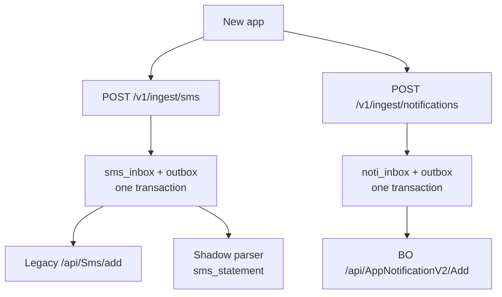

# 07 · SMS and notification ingest

| | |
|---|---|
| **For** | Ingest handlers, the shadow parser, and the two forward payloads |
| **Answers** | How one SMS or bank notification is accepted, stored, and delivered to the system that confirms deposits |
| **Depends on** | `06-sim.md` (device row, secrets), `10-legacy-bridge.md` (outbox) |

> **Boundary:** During coexistence, legacy confirms SMS deposits and the Back Office confirms notification deposits, exactly as today. This service stores each item and forwards it. It does not credit, match, send the OTP hook, or alert on Telegram.


```mermaid
flowchart TB
    APP["New app"] --> SMS["POST /v1/ingest/sms"]
    APP --> NOTI["POST /v1/ingest/notifications"]
    SMS --> SIN["sms_inbox + outbox<br/>one transaction"]
    NOTI --> NIN["noti_inbox + outbox<br/>one transaction"]
    SIN --> LEG["Legacy /api/Sms/add"]
    SIN --> SH["Shadow parser<br/>sms_statement"]
    NIN --> BO["BO /api/AppNotificationV2/Add"]
```

## Shared response

| Result | HTTP | Body |
|---|---|---|
| Accepted: stored, duplicate, or ignored sender | 200 | empty |
| Token problem | 401 | `{ "message", "code" }` |
| Validation or signature failure | 400 | `{ "message", "code" }` |
| Storage failure after validation | 500 | `{ "message", "code": "STORAGE_FAILED" }` |

A 200 is sent only after the inbox row and its outbox item are committed together.

## SMS

`POST /v1/ingest/sms`, Bearer token. One SMS per request.

| Field | Required | Notes |
|---|---|---|
| `phoneNumber` | yes | SIM that received it, as sent |
| `content` | yes | at most 1024 characters |
| `from` | yes | sender mask, at most 100 characters. `""` when the phone has none |
| `timestamp` | yes | epoch milliseconds, device clock |
| `merchantId` | yes | as today's app sends it |
| `signature` | yes | see below |

The master merchant code comes from the device row. The system code (`INTERNAL` / `RESELLER`) comes from the token.

### Signature

```text
signature = uppercase hex SHA256( X-Device-Id + phoneNumber + from + timestamp
                                  + uppercase hex SHA256(content) + deviceSecret )
```

Use the values exactly as sent, with `timestamp` as a decimal string and no separators. The signature covers the content, so a body cannot be changed in transit. A replayed request is a duplicate and changes nothing, so there is no nonce.

### Validation order

1. Token checks as in `04`.
2. Payload and lengths. Else 400 `MISSING_FIELD` or `FIELD_TOO_LONG`.
3. Normalise `phoneNumber` (`06`). Else 400 `INVALID_PHONE`.
4. Sender allow-list, when verify-sender is on for this environment: the hard-coded list plus the masks synced from legacy (below). **A sender that fails returns 200 and is neither stored nor forwarded.** Legacy would drop it too.
5. A row for (normalised phone, `X-Device-Id`) exists and is logged in. Else 400 `DEVICE_NOT_ACTIVATED`.
6. Signature, with that row's `Secret`. Else 400 `INVALID_SIGNATURE`.
7. Insert the `sms_inbox` row and, when `shouldFwdSmsToLegacy` is on, an outbox item `legacy.sms`, in one transaction. A duplicate raw key returns 200 and adds nothing.

Raw key: `(from, SHA256(content), normalised phone, timestamp)`. This is the same key legacy uses, so a forwarded retry is also a duplicate on legacy.

There is no maximum SMS age. The old app's queue (`03`) may deliver old items.

### Forward to legacy

Outbox kind `legacy.sms` → legacy `POST /api/Sms/add`:

```json
{
  "MerchantId": 0,
  "MasterMerchantCode": "row MerchantCode",
  "MerchantCode": "token system code",
  "PhoneNumber": "as sent in this request",
  "Content": "", "From": "", "Timestamp": 0,
  "DeviceId": "X-Device-Id as sent",
  "Signature": "uppercase hex SHA256(PhoneNumber + DeviceId + LegacySecret)"
}
```

Build the signature when the item is sent, using the row's current `LegacySecret`. If the row no longer has one, park the item.

| Legacy answer | Outbox action |
|---|---|
| `0000` (stored, duplicate, or sender dropped) | done |
| `1004`, 5xx, timeout | retry |
| `1001` (legacy row not logged in), `1002` (legacy secret mismatch) | park and alert. Legacy and this service disagree about the binding. The reconcile in `10` should fix it, then an operator re-queues the item |
| `1006`, `1007` | park and alert. It passed validation here, so this is a bug |

Legacy then parses the SMS, sends the OTP hook, alerts Telegram, and serves the Back Office's confirmation pull, as it does today.

### Sender masks and templates

Every 60 seconds, copy the sender masks and SMS templates from legacy. Legacy is where the Devsite edits them. **Confirm** the legacy read route: the template page reads it through the BO proxy as `all`. If a sync fails, keep the last good copy.

### Shadow parser

The shadow parser turns inbox rows into `sms_statement` rows. It exists so that the parity report (`11`) can prove the parser before this service ever confirms a deposit.

- The worker claims inbox rows with `FOR UPDATE SKIP LOCKED`. A row in `processing` for more than 5 minutes may be claimed again.
- Parse order: the hard-coded parser by sender (`bKash`, `NAGAD`, `16216`, `upay`, in that order), then the synced templates for that exact mask, by `Priority`.
- Apply the amount sign rule on every hard-coded case: positive means money into the wallet. Do not copy legacy's bKash Case 1 bug. The parity report expects that difference.
- A transfer time that cannot be parsed marks the row `parse_failed`. Never store a minimum date.
- Log every parse failure with the sender and a redacted body.
- Statement key: `(bankCode, transactionCode, normalised phone, transferredTime)`.
- `transferredTime` is kept as parsed (Bangladesh local for BDT banks), plus a `transferredTimeUtc`, and the offset used.
- Balance check against the previous statement for the same phone and bank within 6 hours, both times in UTC: `|previousBalance + amount − balance| ≥ 20000` stores `suspect`, otherwise `valid`.

Nothing outside this service reads these statements during coexistence.

## Bank notification

`POST /v1/ingest/notifications`, Bearer token. It carries the same fields today's app posts to the Back Office, plus the signature today's app already computes.

| Field | Required | Notes |
|---|---|---|
| `phoneNumber` | yes | collecting SIM |
| `title`, `content` | yes | at most 512 and 4000 characters |
| `packageName` | yes | bank app package |
| `timestamp` | no | epoch ms. Omit it, rather than sending 0, when unknown |
| `masterMerchantCode` | yes | as today's app signs it |
| `boSignature` | yes | computed exactly as today's app computes the V2 signature, over `masterMerchantCode + packageName + phoneNumber + X-Device-Id + timestamp + title + content` |

This service does not verify `boSignature`. It does not hold the Back Office's keys. The Back Office verifies it, and it covers the content from end to end. Nothing needs a SIM activation.

### Validation order

1. Token checks as in `04`, except that the device-ping activation check does not apply.
2. Required fields and lengths. Else 400 `MISSING_FIELD` or `FIELD_TOO_LONG`.
3. Insert the `noti_inbox` row with the raw values and an outbox item `bo.notification`, in one transaction. Key: SHA256 of the forward body. A duplicate returns 200.

### Forward to the Back Office

Outbox kind `bo.notification` → BO `POST /api/AppNotificationV2/Add`. Send the values **byte for byte** as received. The signature was made over them.

```json
{ "PhoneNumber": "", "Title": "", "Content": "", "PackageName": "",
  "DeviceId": "X-Device-Id", "MasterMerchantCode": "", "Timestamp": 0, "Signature": "boSignature" }
```

Leave out `Timestamp` when the app left it out.

| BO answer | Outbox action |
|---|---|
| `0000` (stored or duplicate) | done |
| `1099`, 5xx, timeout | retry |
| `1002`, `1006`, `1007`, `1012`, `1001` | park and alert, keeping the code |

The Back Office then parses, matches, and confirms, as it does today.

**Confirm** with the app team whether the new app still sends V1 notifications (`/AppNotification/Notification`, VND and THB banks). If it does, add a second outbox kind with the same rules.

## Time

| Field | Meaning |
|---|---|
| `timestamp` in a request | Device clock |
| `receivedAt` on an inbox row | Server UTC when the request was accepted |
| `transferredTime` on a shadow statement | Parsed from the body, source local time, plus `transferredTimeUtc` |

## Done when

- A 200 is returned only after the inbox row and the outbox item are committed. A restart loses nothing that was acknowledged.
- Each accepted SMS appears in legacy within 2 minutes, and a deposit on a new-app SIM confirms exactly as on an old-app SIM.
- Each accepted notification reaches the Back Office within 2 minutes, and confirms as today.
- A duplicate returns 200 and produces one legacy row or one BO event.
- An ignored sender returns 200, and is neither stored nor forwarded.
- A tampered SMS body fails `INVALID_SIGNATURE`.
- This service sends no OTP hook and no Telegram SMS alert while `shouldFwdSmsToLegacy` is on.
- The shadow parser produces statements that the parity report can compare.
