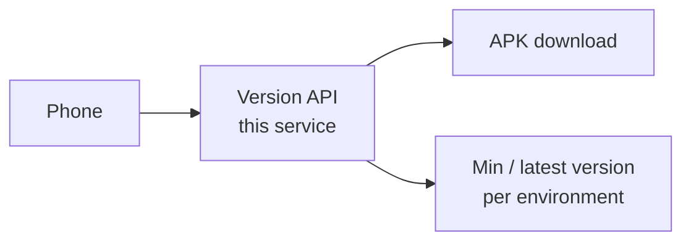

# 08 · Version and release

**Status:** placeholder. Do not implement from this file until it is marked written.
**Depends on:** `01-principles.md`, `03-mobile.md`.
**This file will answer:** how the app learns whether it must update, and where it downloads the APK.

Ping does not gate app version. That behaviour moves here. See `04-device-ping.md`.

## Scope (to write)

- `GET /v1/system/app-version` (or equivalent): `versionCode`, `minVersionCode`, `apkUrl`, advisory `isForceUpdate`, `isForceLogout`
- Per-environment configuration: Internal and Reseller do not share one source
- `GET` APK download: storage key, rate limits, canonical URL rules
- Legacy alias: `GET /device/GetVersion`, `GET /device/DownloadApk`
- Dual-run: optional forward to legacy host when a flag is on (name TBD)
- Response shape: HTTP 200 / 400 `{ "message", "code" }` for new clients; legacy casing preserved on aliases

## Out of scope until decided elsewhere

- Canary %, whitelist, A/B cohorts (may move to `09-app-remote-config.md` or stay here — decide when writing)
- Enforcing force-logout on the server (today advisory on the client)

## Open when writing

- Which host is authoritative for min version during migration
- Authentication on version check before SIM activate (unauthenticated read vs token)
