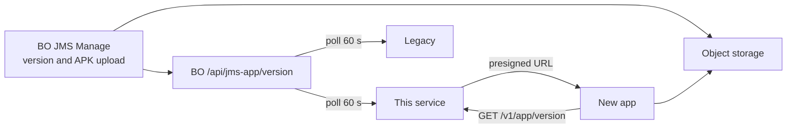

# 08 · Version and release

| | |
|---|---|
| **For** | The version poller, the version route, and app update behaviour |
| **Answers** | How the new app learns it must update, and where it gets the APK |
| **Old app** | Keeps using legacy `GetVersion`. Moving it onto the new app is in `11-rollout.md` |


```mermaid
flowchart LR
    MANAGE["BO JMS Manage<br/>version and APK upload"] --> BOV["BO /api/jms-app/version"]
    MANAGE --> S3["Object storage"]
    BOV -->|"poll 60 s"| JMS["This service"]
    BOV -->|"poll 60 s"| LEG["Legacy"]
    APP["New app"] -->|"GET /v1/app/version"| JMS
    JMS -->|"presigned URL"| APP
    APP --> S3
```

Operators publish exactly as today, in the Back Office's JMS Manage page. The new app uses the **same app key** as the old app. So one publish reaches both: the old app sees it through legacy, and the new app sees it through this service.

Ping does not check the version (`04`). The app enforces updates itself.

## Poller

Every 60 seconds, per environment: `GET {BO}/api/jms-app/version?appKey={appKey}`, with header `X-JMS-Signature = SHA256(appKey + appVersionSecret + "|jms-app-version")`.

It returns `{ isSuccessful, data: { VersionCode, MinVersionCode, IsForceUpdate, IsForceLogout, ApkVersion, ApkTimestamp } }`.

- On any error, keep the last good value, and alert after 5 minutes without one. Never clear it.
- If `MinVersionCode` is higher than `ApkVersion`, log an error and serve `ApkVersion` as the minimum. Otherwise a wrong setting would block devices that have nothing to update to.
- Export the served values as metrics, so a wrong minimum is visible before phones stop.

Reseller today reads version data from the Internal host. **Confirm** with the Back Office whether the Reseller BO publishes its own. Until it does, the Reseller deployment polls the Internal BO. That is the one documented exception to separate configuration.

## Route

`GET /v1/app/version`. No token, because the app checks before login. It needs `X-Build-Number`.

```json
{
  "latestVersionCode": 0,
  "minVersionCode": 0,
  "forceUpdate": false,
  "forceLogout": false,
  "apkUrl": "presigned object-storage URL"
}
```

| Field | Rule |
|---|---|
| `forceUpdate` | `true` when the build is below `minVersionCode`, or when `IsForceUpdate` is on and the build is below `latestVersionCode` |
| `forceLogout` | `IsForceLogout` as published |
| `apkUrl` | Presigned GET for `{apkPrefix}/{folder}/app-release-v{ApkVersion}-t{ApkTimestamp}.apk`, valid for 1 hour. Empty when the object does not exist |

- No value loaded yet returns 503 `VERSION_NOT_LOADED`.
- Rate limit per client IP: 60 requests per minute.

The APK is downloaded straight from object storage, so this service carries no APK traffic.

## App behaviour

| When | App does |
|---|---|
| On start, every 6 hours, and after a `forceUpdate` screen is dismissed | Call the route |
| `forceUpdate` | Show a blocking update screen. **Stop pings and uploads**, and keep the queue. Resume after the update |
| `forceLogout` | Run the logout in `03`, then the first-launch sequence |
| Route unreachable | Keep working with the last answer |

Stopping collection on `forceUpdate` is how a minimum version takes effect. The safety rule in the poller keeps a mistake from stopping phones that cannot update.

## Done when

- Publishing a build in JMS Manage shows on the route within 2 minutes.
- A build below the minimum gets `forceUpdate: true` and stops collecting. A build at or above it does not.
- A minimum above the published APK is ignored and logged.
- A BO outage keeps serving the last value.
- The APK downloads from the presigned URL.
