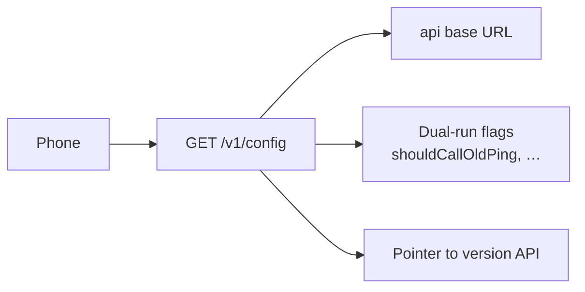

# 09 · App remote config

**Status:** placeholder. Do not implement from this file until it is marked written.
**Depends on:** `01-principles.md`, `03-mobile.md`, `05-user-login.md`.
**This file will answer:** what the phone downloads instead of hardcoded gateway URLs and feature routing in the APK.

Feature flags for SMS, notification collection, and ping enablement stay on the user service and are read through `POST /v1/auth/config` in `05-user-login.md`. This file is for **infrastructure and rollout config**, not those flags.

## Scope (to write)

- `GET /v1/config` (and optional `configVersion` / ETag): single `apiBaseUrl`, refresh policy, which legacy forwards the app should perform
- When to refetch: after login, on interval, on push nudge (if any)
- Relationship to `08-version-release.md`: version numbers and APK URL may be linked or separate endpoints — decide when writing
- No embedded `API_URL_SMS_*`, `API_URL_NOTIFICATION_*`, or `API_URL_BO_*` in production builds after cutover

## Out of scope until decided elsewhere

- Per-tenant merchant routing tables on the server (only what the app needs in the config payload)
- Operator UI to edit config (may be BO or a future console)

## Open when writing

- Whether `shouldCallOldPing` / `shouldCallOldIngest` are delivered here or only on the server
- Signed config responses and cache invalidation
