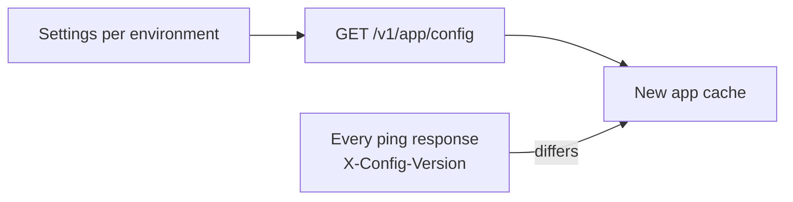

# 09 · App remote config

| | |
|---|---|
| **For** | The config route and the app's config cache |
| **Answers** | What the app downloads instead of hard-coding hosts and passthrough behaviour |
| **Not here** | User feature flags. They come from `GET /v1/auth/config` (`05`) |


```mermaid
flowchart LR
    SET["Settings per environment"] --> CFG["GET /v1/app/config"]
    CFG --> APP["New app cache"]
    PING["Every ping response<br/>X-Config-Version"] -->|"differs"| APP
```

## Route

`GET /v1/app/config`, Bearer token. It supports `If-None-Match`, and answers 304 when nothing changed.

```json
{
  "configVersion": "sha of this body",
  "apiBaseUrl": "https://…",
  "pingIntervalSeconds": 60,
  "shouldCallOldPing": false,
  "legacyPingBaseUrl": "https://…",
  "notiPingBaseUrl": "https://…",
  "legacyFallbackAfterSeconds": 300,
  "refreshIntervalSeconds": 900
}
```

| Field | Rule |
|---|---|
| `configVersion` | Also sent as the `ETag`, and as `X-Config-Version` on every ping response |
| `apiBaseUrl` | This service. The APK embeds one bootstrap URL per build flavour. The app switches to this value, and falls back to the bootstrap URL if it stops answering |
| `shouldCallOldPing` | `true` exactly when `pingLegacyRoute` is `phone`. The app never receives it any other way |
| `legacyPingBaseUrl`, `notiPingBaseUrl` | Hosts for the phone-side legacy pings (`04`). Empty after coexistence, which also turns off the fallback |
| `legacyFallbackAfterSeconds` | See `03-mobile.md` |
| `refreshIntervalSeconds` | Upper bound between refetches |

Values are per environment. The APK contains no legacy, Back Office, or notification host.

## When the app refetches

- After login.
- When a ping response carries an `X-Config-Version` different from the cached one.
- After `refreshIntervalSeconds` at the latest.

The app keeps the last good config on disk. It uses it when the route is unreachable, including right after a restart.

## Done when

- Changing a setting reaches every pinging phone within one ping interval.
- `shouldCallOldPing` can only be `true` when this service is not forwarding pings, apart from the switch overlap in `04`.
- The new APK contains no legacy or Back Office host.
