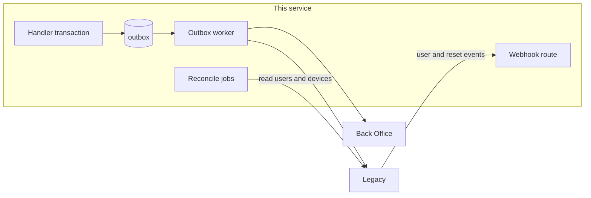

# 10 · Legacy bridge

| | |
|---|---|
| **For** | The outbox, the legacy webhook, the reconcile jobs, and B2B passthrough |
| **Answers** | How this service stays in step with legacy and the Back Office during coexistence |
| **Payloads** | Each call's body lives in the file that owns the call (table below) |

## Every call this service makes

| Call | Target | How | Owner |
|---|---|---|---|
| Login | legacy `POST /api/User/login` | sync | `05` |
| User flags | legacy `POST /api/User/get-user-config` | sync | `05` |
| Account verify | BO `POST /api/account/verify-bo-account` | sync | `06` |
| Activate | legacy `POST /api/Device/active` | sync | `06` |
| Sign-out | legacy `POST /api/Device/sign-out` | outbox `legacy.signout` | `06` |
| App reset | legacy `POST /api/Device/reset` | outbox `legacy.reset` | `06` |
| Device ping | legacy `POST /api/Device/ping` | ping forwarder | `04` |
| Leader ping | legacy `POST /api/leader-account/ping` | ping forwarder | `04` |
| Notification ping | BO notification ping | ping forwarder | `04` |
| SMS | legacy `POST /api/Sms/add` | outbox `legacy.sms` | `07` |
| Bank notification | BO `POST /api/AppNotificationV2/Add` | outbox `bo.notification` | `07` |
| Masks and templates | legacy template list | sync job, 60 s | `07` |
| Version | BO `GET /api/jms-app/version` | poller, 60 s | `08` |
| User reconcile | legacy `POST /api/User/fetch` | job, hourly | here |
| Device reconcile | legacy `POST /api/Device/fetch-dev-site-devices` | job, 15 min | here |
| B2B | legacy `/api/jms/b2b/*` | sync | here |

Legacy and Back Office routes carry no authentication today. They rely on network placement, so this service's egress addresses must be allowed on both. Every call has a 5-second timeout unless its owner says otherwise.

## Outbox

Table `outbox`: `id`, `kind`, `partitionKey`, `dedupKey`, `payload`, `state` (`pending`, `done`, `parked`), `attempts`, `nextAttemptAt`, `lastError`, `createdAt`, `doneAt`.

1. **Same transaction.** The item is inserted in the same transaction as the local write it belongs to. There is no path that commits one without the other.
2. **Claiming.** The worker claims due items with `FOR UPDATE SKIP LOCKED`, at most 32 calls in flight.
3. **Order per SIM.** `partitionKey` is the normalised phone. An item is not sent while an older pending item has the same key. So a sign-out never overtakes that SIM's SMS, and legacy never rejects the SMS as logged out.
4. **Retry.** A retryable failure waits `min(2^attempts, 300)` seconds. There is no attempt limit: money evidence is never dropped for a transient error.
5. **Park.** A permanent failure, as listed by the owner file, sets `parked` and alerts. An operator re-queues parked items after fixing the cause.
6. **Idempotent targets.** Every target is idempotent for a repeated item: legacy and the BO deduplicate, and sign-out and reset are idempotent. So at-least-once delivery is enough.
7. **Retention.** `done` items are deleted after 7 days. `parked` items are never deleted automatically.

| Alert | Threshold |
|---|---|
| Oldest pending `legacy.sms` or `bo.notification` | more than 2 minutes |
| Oldest pending `legacy.signout` or `legacy.reset` | more than 15 minutes |
| Any `parked` item | immediately |

`06` activation step 4 may send a SIM's pending `legacy.signout` or `legacy.reset` synchronously, ahead of the worker. It claims the item the same way.

## Webhook from legacy

`POST /v1/internal/legacy-events`. Called by legacy only. **This is a change to legacy, owned by the legacy team** (`11`).

| Header | Value |
|---|---|
| `X-Legacy-Timestamp` | Unix seconds. Rejected when more than 5 minutes from server time |
| `X-Legacy-Signature` | Lowercase hex `HMAC-SHA256(legacyWebhookSecret, timestamp + "." + rawBody)` |

Body: `{ "eventId", "type", "occurredAt", "data" }`. `eventId` is stored in `legacy_event`. A repeat returns 200 and does nothing.

| `type` | Legacy emits it from | `data` | This service does |
|---|---|---|---|
| `user.status_changed` | `change-status` | `{ username, status }` | For disabled or deleted, set `revokedBefore = now` (`05`) |
| `user.password_changed` | `change-password` | `{ username }` | Set `revokedBefore = now` |
| `device.reset` | `reset2`, `reset-by-device-id`, `telegram-reset-device` | `{ scope: "phone" or "deviceId", phoneNumber?, deviceId?, actor, reason? }` | Operator reset (`06`), with source `webhook` |

Success is 200. A bad signature or skew is 401. Legacy should retry a non-200 answer. The reconcile jobs catch anything it loses.

## Reconcile jobs

They are a safety net for the webhook. They also produce the adoption numbers in `11`.

**Users, hourly.** Page through legacy `POST /api/User/fetch` with `Status` 2, then 3, at a limit of 500. Authenticate with `X-BO-DateTime` (`yyyyMMddHH`, UTC) and `X-BO-Signature = MD5(userAdminSharedSecret + X-BO-DateTime)`. For each username, set `revokedBefore = now` if it is not already later than the user's last known change.

**Devices, every 15 minutes.** Read legacy's device list per master merchant code. **Confirm** the request and response shape of `fetch-dev-site-devices`. For each logged-in row here whose legacy row is logged out, or has a different device id, apply an operator reset (`06`) with source `reconcile`. Then record, per environment:

| Number | Meaning |
|---|---|
| `legacyOnlySims` | Logged in on legacy, not bound here with the same device id: still on the old app |
| `bridgedSims` | Bound on both, with the same device id |
| `driftFixed` | Rows reset by this run |

## B2B passthrough

Only if the new app ships B2B. **Confirm** this with the app team.

| New route (Bearer) | Legacy route |
|---|---|
| `POST /v1/b2b/request` | `POST /api/jms/b2b/request` |
| `POST /v1/b2b/confirm-refcode` | `POST /api/jms/b2b/confirm-refcode` |
| `POST /v1/b2b/history` | `POST /api/jms/b2b/history` |
| `POST /v1/b2b/check-status` | `POST /api/jms/b2b/check-status` |

- Forward the body. Take `AgentPhone`, `DeviceId`, and `MerchantCode` from the token and the device row, never from the body.
- Return legacy's answer, mapped to `{ message, code }`.
- The Back Office's approval comes back to the phone through legacy's FCM push. That works because ping passthrough keeps legacy's FCM token current.
- **Confirm** how today's app authenticates to legacy for B2B, and reproduce that on the forward.

## Secrets

Each one comes from the secret manager, per environment, and is never logged:

- legacy webhook secret
- user-admin shared secret
- app-version secret
- notification secret
- token signing key
- legacy-secret encryption key

Request logs redact passwords, SMS content, notification content, and every signature.

## Done when

- Killing the process at any point loses no acknowledged SMS, notification, sign-out, or reset.
- A sign-out for a SIM is sent only after all of that SIM's earlier SMS.
- A replayed or unsigned webhook is refused. A repeated event is applied once.
- With the webhook switched off, the reconcile jobs alone bring this service in line with legacy within 1 hour for users and 15 minutes for devices.
- `legacyOnlySims` is published per environment.
