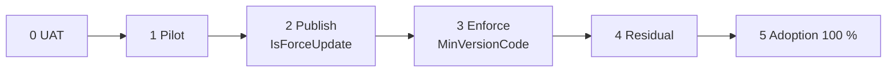

# 11 · Rollout

| | |
|---|---|
| **For** | Whoever runs the release, and the teams it depends on |
| **Answers** | How the fleet moves from the old app to the new one, how we know it is done, and what to do when it goes wrong |
| **Tasks** | `12-work-breakdown.md` |



## Phases

| Phase | Action | Exit when |
|---|---|---|
| 0 · UAT | Full build against legacy UAT and BO UAT. `pingLegacyRoute = server`. | Every "Done when" in `04`–`10` passes. A deposit on a UAT SIM confirms through the new app |
| 1 · Pilot | Install by hand on 5–10 pilot phones per environment, Internal first. | 5 days with: pilot accounts never dropped by the BO; SMS and notifications in legacy or BO within 2 minutes (p99); every pilot deposit confirmed; BO push received; no parked outbox item left unexplained |
| 2 · Publish | Upload the new build in JMS Manage under the current app key. Set `IsForceUpdate`. Leave `MinVersionCode` unchanged. Old apps prompt the operator, and the new app installs in place (`03`). | `legacyOnlySims` below the agreed threshold (proposal: 5 %) |
| 3 · Enforce | Announce a date. Raise `MinVersionCode` to the first new build. | 2 days stable |
| 4 · Residual | Work through the remaining `legacyOnlySims` by hand: update the phone, or reset the SIM. | `legacyOnlySims = 0` |
| 5 · Done | 7 consecutive days with `legacyOnlySims = 0`. Coexistence ends. | Legacy retirement planning starts. It is not written in this folder |

### Phase 3: what raising the minimum does

Legacy's ping gate blocks an old app only when `UIVersion` is 2 **and** `AppVersion` is not 0.

- A blocked old app stops pinging. Within 10 minutes the Back Office stops routing deposits to its accounts. That is the lever. Operations must announce it first.
- **UIVersion 1 apps, and apps that report version 0, are never blocked.** They stay in `legacyOnlySims` until phase 4.
- New-app pings reach legacy with `AppVersion` 0 (`04`), so raising the minimum never blocks passthrough.

## Adoption

Adoption is measured by SIM, from the device reconcile in `10`:

```text
adoption = bridgedSims / (bridgedSims + legacyOnlySims)
```

Publish it per environment and per master merchant code, daily, to the operations channel. Leaders have no SIM, so leader adoption is measured separately. **Confirm** with the legacy team whether leader devices can be listed.

## Parity report

The parity report lets the shadow parser (`07`) be trusted before deposit confirmation ever moves here. It does not block coexistence.

- **Daily.** For SIMs on the new app, compare the shadow statements here with legacy's statements, read through legacy `POST /api/sms/fetch-sms`.
- **Key:** `(bankCode, transactionCode)`. Compare amount, balance, fee, transfer time, and sign.
- **Expected difference:** bKash Case 1 sign. Anything else is a parser defect.
- **Goal:** 100 % agreement for 7 consecutive days before the deposit-confirmation topic is written.

## When something breaks

| Failure | Effect | Response |
|---|---|---|
| This service is down | New pings fail. After `legacyFallbackAfterSeconds` phones ping legacy directly (`03`), so deposit routing holds. SMS and notifications wait in the phone's queue, so confirmations are late but nothing is lost | Restore the service. The queues drain themselves |
| Legacy is down | Pings and SMS wait in this service's forwarder and outbox. The BO drops accounts after 10 minutes, as it would today | Restore legacy. Delivery resumes without action |
| BO is down | Notifications wait in the outbox. Activation returns `BO_UNAVAILABLE` | Restore the BO |
| The ping forwarder is stuck | Pending age alert at 2 minutes | Switch `pingLegacyRoute` to `phone`. Phones take over within one ping interval |
| Bad new-app build | Android cannot downgrade in place | Fix forward. Stop the rollout by clearing `IsForceUpdate` and not raising the minimum |
| Parked items | Alert | Fix the cause, often a binding mismatch fixed by reconcile. Then re-queue |

## Dashboards and alerts

- Outbox oldest-pending age per kind, and parked count.
- Ping forwarder oldest-pending age.
- Legacy and BO error rate and latency, per call in the `10` table.
- Login, activation, and ingest failures, by `code`.
- 401 rate on pings.
- Adoption, `legacyOnlySims`, and `driftFixed`.
- Served `minVersionCode` compared with the published APK.
- Parity mismatches.

## External dependencies

| Owner | What | Needed by |
|---|---|---|
| Legacy team | Emit the webhook in `10` from `change-status`, `change-password`, `reset2`, `reset-by-device-id`, `telegram-reset-device` | Phase 1. Without it, reconcile alone gives up to 1 hour of lag on disabled users |
| Legacy team | Confirm: sign-out body and signature, client-IP header name, template list route, `fetch-dev-site-devices` shape, login error body, leader device listing | Before build of `04`, `05`, `06`, `07`, `10` |
| BO team | Confirm: notification ping route and signature. Whether verify-account expects the normalised phone. Whether Reseller publishes its own version | Before build of `04`, `06`, `08` |
| BO team | Allow this service's egress addresses | Phase 0 |
| App team | Same package, signing key, and device id. `boSignature` as today. Old queue drain. B2B and V1 notification scope | Before build |
| Operations | Pilot phones and operators. Announcement before phase 3. Owner for the residual list | Phases 1, 3, 4 |
